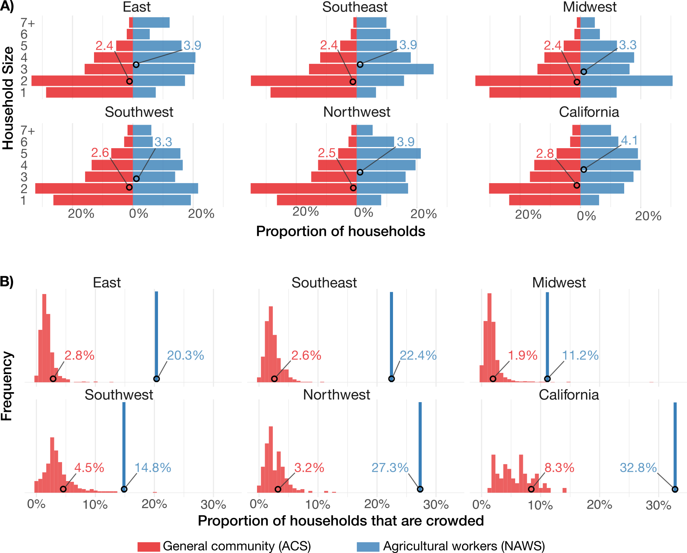

<!--

{ cat writeup/agri_resp/agri_resp_title.md; printf '\n\n'; 
cat writeup/agri_resp/agri_resp_abstract.md; printf '\n\n'; 
cat writeup/agri_resp/agri_resp_intro.md; printf '\n\n'; 
cat writeup/agri_resp/agri_resp_methods.md; printf '\n\n'; 
cat writeup/agri_resp/agri_resp_methods_data.md; printf '\n\n'; 
cat writeup/agri_resp/agri_resp_methods_model.md; printf '\n\n'; 
cat writeup/agri_resp/agri_resp_methods_statistics.md; printf '\n\n'; 
cat writeup/agri_resp/agri_resp_results.md; printf '\n\n'; 
cat writeup/agri_resp/agri_resp_discussion.md; printf '\n\n'; 
cat writeup/agri_resp/agri_resp_supplement.md;
} > writeup/agri_resp/agri_resp_full.md

-->

# Modeling the impact of respiratory illness outbreaks on the agricultural workforce and food production in the United States

<!---
FIGURE LIST: 
Main: 
- [ ] Household size and crowding (histograms, maps) 
- [ ] Disease simulations 
- [ ] Crop impacts 

Supplementary: 
- [ ] Crop movements over time and averaged 
- [ ] Table of baseline and sensitivity parameter values 
- [ ] Three methods for county imputation 
- [x] Model structure 
- [x] Sensitivity to R0
- [x] Sensitivity to eta
- [x] Sensitivity to SAR 
- [x] Sensitivity to crowding fold difference 
- [ ] Sensitivity to county imputation method 

Other to do: 
- [ ] 

--->

## Abstract

**Background:** Respiratory disease outbreaks pose significant threats to critical infrastructure, including food production systems. Agricultural workers face elevated disease transmission risk due to crowded living conditions and occupational exposures, yet the impact of respiratory outbreaks on agricultural labor and productivity remains poorly quantified. 

**Methods:** We developed a household-structured susceptible-infectious-recovered (SIR) transmission model to compare disease dynamics between agricultural workers and the general U.S. population. Using data from the American Community Survey and National Agricultural Workers Survey, we parameterized household size and crowding distributions across six regions. We simulated outbreaks with reproduction numbers ranging from 1.2 to 3.0 across various assumptions on household secondary attack rate and assortative mixing. We assessed productivity losses for three labor-intensive crops (oranges, lettuce, strawberries) with different harvest seasonalities. 

**Results:** Compared to the general population, agricultural worker households are substantially larger (mean household size: 3.3-4.1 vs. 2.4-2.8 across regions) and more crowded (proportion of households crowded: 11-33% vs. 2-8% across regions). For a baseline reproduction number of $R_0$ = 1.5, peak disease prevalence among agricultural workers was 1.23-1.45 times higher than that of the general population across regions, and final outbreak sizes were 1.15 to 1.28 times higher. Under baseline assumptions, maximum productivity losses were estimated at 0.62% for strawberries, 0.50% for lettuce, and 0.50% for oranges, translating to $21,511,907, $6,257,962, and $4,275,115 USD, respectively.

**Conclusions:** Household crowding may lead to disproportionate respiratory disease burden among agricultural workers, potentially generating substantial food production losses. These findings highlight the need for targeted outbreak preparedness and mitigation strategies in the agricultural sector to maintain food system resilience. 

## Introduction

Respiratory disease outbreaks can cause societal and economic disruptions that cascade beyond their direct public health burden. The food system, which encompasses food production, processing, and distribution, is particularly susceptible to labor-driven shocks [x](https://www.nature.com/articles/s41586-021-03621-0) [x](https://www.cdc.gov/mmwr/volumes/69/wr/mm6927e2.htm). During the COVID-19 pandemic, agricultural labor shortfalls contributed to an estimated $309,000,000 reduction in U.S. farm output [x](https://journals.plos.org/plosone/article?id=10.1371%2Fjournal.pone.0250621). Meanwhile, outbreaks in meat packing plants forced widespread facility closures [x](https://www.cdc.gov/mmwr/volumes/69/wr/mm6927e2.htm) [x](https://www.sciencedirect.com/science/article/pii/S030691922100049X), and shifts in demand and the closure of schools and restaurants caused distribution bottlenecks and shortages of staple goods [x](https://www.sciencedirect.com/science/article/abs/pii/S0308521X21000548). The agricultural workforce, consisting of approximately 3.2 million people [x](https://www.ers.usda.gov/topics/farm-economy/farm-labor), sits at the foundation of the food system, and their health determines its capacity to function. 

Agricultural workers in the United States face various health vulnerabilities that put them at elevated risk during respiratory disease outbreaks. Many have restricted access to healthcare [x](https://ajph.aphapublications.org/doi/full/10.2105/AJPH.2009.190892) and high rates of chronic conditions including diabetes [x](https://journals.lww.com/joem/abstract/2021/04000/prevalence_of_diagnosed_diabetes_among_employed_us.6.aspx) and obesity [x](https://www.frontiersin.org/journals/public-health/articles/10.3389/fpubh.2022.1024083/full?trk=public_post_reshare_feed-article-content), along with high rates of baseline respiratory illnesses [x](https://academic.oup.com/occmed/article-abstract/52/8/451/1404429) [x](https://www.tandfonline.com/doi/abs/10.1080/10599240701881482). Furthermore, housing conditions, including household size and crowding, may contribute to poorer health an elevated risk of infection [x](https://journals.sagepub.com/doi/abs/10.1177/1048291115601053) [x](https://jamanetwork.com/journals/jamanetworkopen/fullarticle/2784117) [x](https://journals.sagepub.com/doi/abs/10.1177/1048291115604390) [x](https://www.tandfonline.com/doi/abs/10.1080/1059924X.2014.947458). Household crowding was a primary risk factor for SARS-CoV-2 infection among farmworkers [x](https://jamanetwork.com/journals/jamanetworkopen/fullarticle/2784117) and is more broadly associated with higher risk of COVID-19, influenza, and RSV infection and hospitalization [x](https://link.springer.com/article/10.1186/1471-2334-12-95) [x](https://pmc.ncbi.nlm.nih.gov/articles/PMC11130583/) [x](https://jamanetwork.com/journals/jamanetworkopen/fullarticle/2774102) [x](https://cdr.lib.unc.edu/concern/articles/wm117x76h) [x](https://jech.bmj.com/content/77/10/649.abstract) [x](https://pmc.ncbi.nlm.nih.gov/articles/PMC4550146/). This may help explain why COVID-19 infection rates were found to be consistently higher among agricultural workers vs. the broader community during the first year of the COVID-19 pandemic [x](https://pmc.ncbi.nlm.nih.gov/articles/PMC8084509/) [x](https://journals.plos.org/globalpublichealth/article?id=10.1371/journal.pgph.0000619). 

Compounding these issues, conducting effective public health surveillance in agricultural workers has proven challenging [x](https://journals.sagepub.com/doi/abs/10.1177/14680173231165928) [x](https://www.tandfonline.com/doi/abs/10.1080/1059924X.2020.1815625). Various important efforts are underway to bridge this gap, including the CDC-supported network of farmworker-serving organizations formed during the COVID-19 pandemic [x](https://ajph.aphapublications.org/doi/full/10.2105/AJPH.2022.307159) [x](https://www.tandfonline.com/doi/abs/10.1080/1059924X.2020.1815625) [x](https://ojphi.jmir.org/2014/2/e61463/PDF) [x](https://www.tandfonline.com/doi/abs/10.1080/1059924X.2020.1815621) [x](https://ajph.aphapublications.org/doi/abs/10.2105/AJPH.2021.306323?journalCode=ajph). Nevertheless, agricultural workers remain a difficult population to reach: agricultural workers may be more likely to mistrust authorities, especially those who are undocumented or on temporary visas, socioeconomic barriers often prevent workers from presenting to care, and seasonal migration complicates longitudinal follow-up [x](https://ajph.aphapublications.org/doi/abs/10.2105/AJPH.2021.306323?journalCode=ajph) [x](https://journals.sagepub.com/doi/abs/10.1177/14680173231165928). These barriers underscore the need for modeling tools that can anticipate the burden of disease among agricultural workers from more readily-available community-level data. However, we currently lack quantitative frameworks for translating known disease transmission risk factors into predictions of how outbreaks will unfold among agricultural workers and what the downstream effects on food production may be. 

This study aims to address these gaps by developing a household-structured disease transmission model that quantifies the differential impacts of respiratory disease outbreaks on agricultural workers relative to the general U.S. population. Using household size and crowding distributions from national surveys, we simulated epidemic dynamics under a range of epidemiological scenarios, assessing the impact of differences in transmissibility, within-household secondary attack rates, and population mixing patterns. We then translate the resulting labor impacts into crop-specific production losses for three economically important, labor-intensive California crops with distinct harvest seasonalities: strawberries, iceberg lettuce, and oranges. Our analysis provides both a quantitative assessment of how outbreaks with varying characteristics might impact agricultural production and a general framework, accompanied by an interactive simulation tool, for anticipating the food system consequences of future respiratory disease outbreaks. 

<!-- 
Respiratory disease outbreaks can cause societal and economic disruptions that cascade beyond their immediate public health impacts. The COVID-19 pandemic illustrated this impact across the full food system, impacting production, processing, and demand. Agricultural workers, the bedrock of the food system, face major vulnerabilities to disease: they have limited access to care, face elevated risk of infection, and have comorbiditeis that make infections more severe. This puts both agricultural workers and the food system itself at risk. 

Despite documented impacts of disease on agricultural labor and food production, the extent and drivers of disease transmission among agricultural workers is less well understood. Household characteristics are known to be a key predictor of disease transmission, and these do differ between agricultural workers and the general population, yet we lack rigorous modeling frameworks for anticipating these impacts -- which would allow us to better understand the extent of unobserved disease transmission among agricultural workers and to assess the potential impact of housing-based interventions on reducing the risk of infection to the health of agricultural workers and the functioning of the food system. 

Agricultural workers are a vulnerable population in multiple senses: they face elevated risks of clinical disease, are economically disadvantaged, and many agricultural workers face language barriers and lack trust in authorities. Success stories include xxx and xxx, but major challenges still remain, as evidenced by xxx. The vulnerabilities faced by agricultural workers not only exacerbate the impact of outbreaks on the agricultural workforce, but also makes it difficult to reliably know what's going on among agricultural workers. There is a critical need to interpret how community disease metrics can be translated into impacts on agricultural workers. 

This study addresses these gaps by developing a disease transmission model specifically designed to anticipate the differential impacts of respiratory virus outbreaks on agricultural workers relative to the general U.S. population. Focusing on household size and crowding – two well-established predictors of respiratory disease transmission – we quantify the relative rate of infections and assess potential impacts on harvesting operations. We apply this framework to three economically important, labor-intensive crops with different harvest seasonalities: oranges, lettuce, and strawberries. Our analysis provides both a quantitative assessment of how outbreaks with varying characteristics might impact the agricultural sector and a generalizable framework for future assessments of disease impacts on agricultural production. 
 -->

<!-- 
Respiratory disease outbreaks can cause societal and economic disruptions that cascade beyond their immediate public health impacts. The food system is particularly vulnerable to outbreaks, with labor losses due to disease impacting xxx [x]. Recently, the COVID-19 pandemic profoundly impacted food production, processing, and distribution [x, Jayson Lusk]. Agricultural workers face significant health risks and disparities that make them vulnerable to respiratory infections [x]. This vulnerability stems from many factors, including an increased rate of comorbidities [x], limited healthcare access [x], frequent migration [x], and household crowding [x]. 

While differences in health outcomes may be straightforward to account for -- the probability of severe illness given infection, for example, may be higher among agricultural workers, so we can just try to measure and account for that difference -- differences in transmission among agricultural workers vs. the general community are harder to anticipate and account for. These could cause substantially different epidemic trajectories among agricultural workers vs. the general population, making it difficult to use standard surveillance to understand what's happening in agricultural communities and to anticipate the timing and extent of the downstream effects.  -->

<!-- Efforts to do outreach to agricultural workers, both for protecting health and surveillance, are varied, including xxx and xxx. Still, we lack a clear understanding of how disease transmission dynamics differ between agricultural workers and the general population. More importantly, we lack predictive tools for anticipating how novel respiratory outbreaks might impact agricultural workers before they occur. Likewise, analytical frameworks for translating these labor impacts into commodity-specific production impacts remain underdeveloped.  -->

<!-- This study addresses these gaps by developing a disease transmission model specifically designed to anticipate the differential impacts of respiratory virus outbreaks on agricultural workers relative to the general U.S. population. Focusing on household size and crowding – two well-established predictors of respiratory disease transmission – we quantify the relative rate of infections and assess potential impacts on harvesting operations. We apply this framework to three economically important, labor-intensive crops with different harvest seasonalities: oranges, lettuce, and strawberries. Our analysis provides both a quantitative assessment of how outbreaks with varying characteristics might impact the agricultural sector and a generalizable framework for future assessments of disease impacts on agricultural production.  -->
<!-- 

## Introduction (v3)

Respiratory disease outbreaks produce economic and societal disruptions that extend far beyond their direct public health burden. The food system -- encompassing production, processing, and distribution -- is particularly susceptible to labor-driven shocks. During the COVID-19 pandemic, outbreaks in meatpacking plants forced facility closures affecting billions of pounds of processing capacity [Waltenburg et al. 2020], panic buying caused acute shortages of staple goods [Hobbs 2020], and agricultural labor shortfalls contributed to an estimated \$309 million reduction in U.S. farm output [Lusk & Chandra 2021]. Agricultural workers -- the approximately 2.4 million hired farmworkers who plant, tend, and harvest the nation's crops [USDA ERS] -- are at the foundation of this system, and their health directly determines its capacity to function.

Agricultural workers in the United States face a constellation of health vulnerabilities that put them at elevated risk during respiratory disease outbreaks. Many are economic migrants with limited English proficiency, restricted access to healthcare, and high rates of chronic conditions including diabetes, obesity, and baseline respiratory illness linked to occupational pesticide and dust exposure [Schenker 1998; Shrestha et al. 2021; Mora et al. 2022]. During the first year of the COVID-19 pandemic, an estimated 9--10% of agricultural workers were infected [Lusk & Chandra 2021], and prospective surveillance in California's Salinas Valley found a SARS-CoV-2 test positivity rate of 22% among farmworkers compared to 17% among other adults [Lewnard et al. 2021]. Among the factors driving this elevated burden, housing conditions stand out as especially consequential for disease transmission: agricultural workers live in households that are substantially larger and more crowded than those of the general population. Household crowding has been identified as a primary risk factor for SARS-CoV-2 infection among farmworkers [Lewnard et al. 2021; Mora et al. 2021] and is associated with higher COVID-19 incidence and mortality across U.S. counties more broadly [Ahmad et al. 2020].

These differences in household structure have implications that go beyond increasing the risk of severe illness for individual workers. While differences in clinical outcomes -- for example, a higher probability of hospitalization given infection -- can be measured and accounted for using standard epidemiological data, differences in *transmission dynamics* are far harder to anticipate and observe. Household size and crowding are fundamental determinants of within-household secondary attack rates, which in turn influence the speed and peak intensity of epidemic spread at the population level [House & Keeling 2009; Madewell et al. 2020]. If epidemic trajectories among agricultural workers differ systematically from trajectories in the general community -- peaking earlier, reaching higher prevalence, or both -- then standard community-level surveillance will underestimate the true burden of disease among agricultural workers, particularly during the critical early phases of an outbreak. Yet we currently lack quantitative frameworks for translating known household-level risk factors into predictions of how outbreaks will unfold among agricultural workers and what the downstream effects on food production may be.

Efforts to conduct disease surveillance and outreach among agricultural workers have yielded important but limited progress. Community health worker (*promotora*) programs have improved health literacy and care access in some regions [x], and the CDC-supported network of farmworker-serving organizations formed during the COVID-19 pandemic demonstrated the feasibility of community-based surveillance partnerships [Bates et al. 2023]. Yet agricultural workers remain among the most difficult populations to reach: immigration-related fears discourage engagement with authorities, seasonal migration complicates longitudinal follow-up, and the absence of paid sick leave means workers often continue working while symptomatic [Handal et al. 2020]. The ongoing challenges in monitoring H5N1 avian influenza exposure among U.S. dairy and poultry workers illustrate these surveillance gaps in a current and ongoing context [x]. These barriers underscore the need for modeling tools that can anticipate the likely burden on agricultural workers from more readily observable community-level data and from known differences in household characteristics.

This study addresses these gaps by developing a household-structured disease transmission model designed to quantify the differential impacts of respiratory virus outbreaks on agricultural workers relative to the general U.S. population. Using household size and crowding distributions from the American Community Survey and the National Agricultural Workers Survey, we simulate epidemic dynamics under a range of scenarios varying in transmissibility, within-household secondary attack rates, and population mixing patterns. We then translate the resulting labor impacts into crop-specific production losses for three economically important, labor-intensive California crops with distinct harvest seasonalities: strawberries, iceberg lettuce, and oranges. Our analysis provides both a quantitative assessment of how outbreaks with varying characteristics might impact agricultural production and a generalizable framework -- accompanied by an interactive simulation tool -- for anticipating the food system consequences of future respiratory disease outbreaks.
 -->

## Methods

### Data

#### Population characteristics

We obtained county-level data on overall population size, household size distribution (proportion of households of size 1, 2, 3, 4, 5, 6, or 7+), proportion of crowded households (i.e., with more than one individual per room), and proportion of agricultural workers from the U.S. Census Bureau’s 2022 American Community Survey (ACS) 5-year estimates. For agricultural workers specifically, we obtained regional data on household size distribution and proportion of crowded households from the 2018-2022 National Agricultural Workers Survey (NAWS). The NAWS data are stratified geographically into six regions: East, Southeast, Midwest, Southwest, Northwest, and California. To enable region-level analysis, we aggregated the county-level ACS data into the corresponding NAWS regions using population-weighted averages. Full details on the data extraction are given in the **Supplementary Methods.** 

#### Crop harvest calendars and labor requirements

To approximate daily harvest volumes, we obtained data on specialty crop movements (point-to-point shipments) for strawberries, iceberg lettuce, and oranges from the United States Department of Agriculture's (USDA's) Agricultural Marketing Services. We extracted the total weekly weight of shipments originating in California for each of these crops between 1 Jan 2018 and 1 Jan 2025. In 2024, California produced approximately [90% of U.S. strawberries](https://www.nass.usda.gov/Publications/Todays_Reports/reports/ncit0525.pdf), [74% of U.S. iceberg lettuce](https://www.nass.usda.gov/Publications/Todays_Reports/reports/vegean25.pdf), and [78% of U.S. oranges](https://esmis.nal.usda.gov/sites/default/release-files/j9602060k/vx023d76b/w9507070x/cfrt0825.pdf). We averaged the weekly shipment volumes for each crop across the seven available years to mitigate the impact of inter-annual variation. Then, we interpolated daily shipment volumes by assuming equal shipment volumes across each day of the week. We normalized these shipment volumes by the total mean annual shipment volume, so that the daily values reflected the proportion of the total harvest normally collected on that day. We cross-referenced the resulting production curves with independent reports on each crop's production timing (**Supplementary Methods, Supplementary Figures S11-S12**). 

<!--- UCLA: "Navels are normally harvested from November to June." And: 

for strawberries: 
Table B. Percent Crop Harvested by
        April May Jun July Aug Sep Oct
Fresh % 5     12  25  26   18  12  2

"Lettuce is planted continuously from late December to mid-August along the Central Coast." "Cool season plantings may require up to 100 days to mature, but as the season warms, time to maturity decreases" ---> 

### Disease transmission model

#### Model structure

We simulated respiratory disease transmission using a deterministic household-structured susceptible-infectious-recovered (SIR) model based on a previously developed framework [x]. We split the population at the household level into "agricultural workers" and "general community", assuming the proportion of households belonging to agricultural workers was equal to the proportion of the working population involved in agricultural work according to the ACS data. 

The model tracks the number of infections over time in the population, explicitly accounting for transmission within and between households of various sizes (**Supplementary Figure S1**). The transmission model has three main epidemiological parameters: the between-household transmission rate ($\beta$), the within-household transmission rate ($\tau$), and the recovery rate ($\gamma$). We allowed the within-household transmission rate $\tau$ to differ for uncrowded vs. crowded households. 

We assumed that mixing among agricultural workers (A) and the general community (C) was assortative, governed by an assortativity parameter $\eta$. We modeled this using the mixing matrix

$$ M =
\begin{pmatrix} m_{CC} & m_{CA} \\\ m_{AC} & m_{AA} \end{pmatrix} =
\begin{pmatrix} \eta + (1-\eta) w_C & (1-\eta) w_A \\\ (1-\eta) w_C & \eta + (1-\eta) w_A \end{pmatrix}
$$

Here, $w_C$ is the fraction of the region's population made up by the general community and $w_A$ is the fraction of the population made up by agricultural workers. This matrix modulates the between-household force of infection $\lambda$ experienced by each population such that

$$\lambda_C = \beta (m_{CC} I_C + m_{CA} I_A)$$
$$\lambda_A = \beta (m_{AC} I_C + m_{AA} I_A)$$

where $\lambda_i$ is the between-household force of infection for members of sub-population $i$, $\beta$ is the between-household transmission constant, and $I_i$ is the proportion of infectious individuals in sub-population $i$; thus, $\eta = 1$ implies completely assortative mixing and $\eta = 0$ implies mixing proportional to each sub-population's size.

Besides the impact of household size, household crowding, and assortative mixing, we did not assume any additional differences in transmission rates between the two sub-populations. For full details on the model structure, see the **Supplementary Methods.** 

#### Model parameterization

Following previous methods [x], we began by fixing the recovery rate $\gamma = 1/5$, which corresponds to a mean infectious period of 5 days [https://www.cdc.gov/flu/spread/index.html]. Then, given $\gamma$ and the household secondary attack rate (SAR), we derived $\tau$ (**Supplementary Methods**). We set the SAR for uncrowded households at 20%, following estimates for influenza [https://pmc.ncbi.nlm.nih.gov/articles/PMC4733423/, https://journals.plos.org/plosone/article?id=10.1371%2Fjournal.pone.0108485, https://jamanetwork.com/journals/jamanetworkopen/fullarticle/2826553]. For crowded households, we set the baseline SAR at 40% [https://arc.net/l/quote/swgtrdas, https://arc.net/l/quote/fifxwuqo, https://arc.net/l/quote/qngfvfuo]. In sensitivity analyses, we considered crowded-household SARs of 0.2, 0.3, 0.5, and 0.6. Last, given values for $\gamma$ and $\tau$, we numerically identified the value of $\beta$ that would achieve a desired basic reproduction number ($\mathcal{R_0}$) when simulating outbreaks at the national level. Specifically, for a candidate $\beta$ value, we ran the model with a single sub-population to equilibrium; then, we compared the outbreak's final size with the theoretical prediction from the implicit relationship $R(\infty) = 1 - \exp(-\mathcal{R_0} \cdot R(\infty))$, where $R(\infty)$ is the final size of the outbreak. [x] We adjusted $\beta$ using a bisection search algorithm until the simulated final size was within 0.0005 of the theoretical value. For the baseline analysis, we used $\mathcal{R_0}$ = 1.5, reflecting a moderate pandemic influenza scenario and the effective reproduction number during many COVID-19 surges when behavioral mitigations were in place. In sensitivity analyses, we considered $\mathcal{R_0}$ values of 1.2, 2.0, and 3.0. Baseline and sensitivity parameter values are listed in **Supplementary Table S2**. 

For the baseline assortativity, we used $\eta = 2/3$. Because agricultural workers constitute a small fraction of the total population ($w_A$ ranges from 0.7% to 2.2% across regions), the proportion of within-group contacts for agricultural workers is approximately equal to $\eta$ ($m_{AA} = \eta + (1-\eta) w_A \approx \eta$, since $w_A$ is small). At the baseline $\eta = 2/3$, agricultural workers have between 66.9% and 67.4% of their contacts within their own group, depending on the region. The general community, being much larger, has nearly all contacts within their own group regardless of $\eta$ ($m_{CC}$ ranges from 97.8% to 99.8% across all regions and values of $\eta$). In sensitivity analyses, we considered $\eta \in \{0, 1/4, 1/3, 1/2, 3/4\}$. At $\eta = 0$ (proportional mixing), agricultural workers have between 0.7% - 2.2% of their contacts within their own group, depending on the region; at $\eta = 3/4$, this rises to between 75.2% and 75.5%.

We assumed symptoms began one day after infection and lasted for three days. For the crop productivity analysis, we assumed half of all infections were symptomatic enough to cause a laborer to miss work ($p_\text{symp} = 0.5$). We also report findings for $p_\text{symp} = 1$. Since production losses scale linearly with $p_{symp}$, results for any other $p_\text{symp}$ can be obtained by scaling the results for $p_{symp} = 1$.

The transmission model requires knowing the fraction of households of each size are crowded, but the ACS and NAWS data report household size distribution and crowding proportion separately. To assign crowding levels by household size, we assumed that the crowding probability increased linearly from households of size 2 to households of size 7+ (since households of size 1 by definition cannot be crowded). We obeyed the constraints that (1) the overall proportion of crowded households must match the ACS- or NAWS-reported proportion, and (2) households of size 7+ are $d$ times as likely to be crowded as households of size 2 (**Supplementary Methods**). We used a baseline of $d = 2$ (i.e. households of size 7+ are twice as likely to be crowded as households of size 2). In sensitivity analyses, we considered $d = 1$ and $d = 3$. 

#### Model implementation

We implemented the transmission model in `R` (version 4.5.0) using `odin` (version 1.2.7). We initialized outbreaks by setting 0.1% of individuals in each sub-population as infectious. We distributed the initial infectious individuals proportionally across household types, approximating uniform random seeding of infections across each sub-population. We simulated outbreaks over 365 days. 

In addition to the main regional simulations, we also generated county-level simulations to explore differences in transmission between agricultural workers and the general population at a finer geographic scale. Since the NAWS dataset does not report at the county level, we imputed county-level household size distributions and crowding proportions for agricultural workers using three different methods: an "additive" method, where county-level NAWS values were imputed by adding the difference between the county-level and regional ACS values to the regional NAWS value; a "multiplicative" method, where regional NAWS values were scaled by the ratio of county-level to regional ACS values; and a "null" method, where regional NAWS values were used without adjustment (**Supplementary Methods**). The "null" method yielded no variation in county-level agricultural household characteristics within a region; the "additive" method yielded an intermediate amount of variation; and the "multiplicative" method yielded a high amount of variation (**Supplementary Figures S2–S3**). We treated the "additive" method as a baseline and considered the "null" and "multiplicative" methods in sensitivity analyses. Due to the high uncertainty in these imputation methods, we emphasize that these county-level results have a low level of confidence and are intended to provide a rough estimate of within-region variation around the regional mean. 

### Outcomes and measurements

We compared the difference in household size distribution (mean household size, proportion of households with 4 or more people) and the difference in household crowding rates between agricultural workers and the general community at the region level. For the outbreak simulations, we measured differences in peak prevalence, time to peak, final size, and maximum incidence deviation between agricultural workers and the general community. 

To translate disease dynamics into agricultural productivity impacts, we estimated the number of workers unable to perform harvest labor each day due to symptomatic illness. We assumed that symptomatic individuals could not perform agricultural labor. This allowed us to calculate a daily "workforce strength", consisting of the fraction of agricultural workers still healthy. We multiplied this workforce strength by the daily harvest fraction for each crop to obtain an outbreak-adjusted harvest volume and summed this adjusted volume over the full year to measure the agricultural impact of the outbreak. We did this for outbreaks peaking on each day of the year to assess the impact of outbreak timing on agricultural productivity for each crop. 

## Results

### Household size and crowding lead to higher modeled disease prevalence among agricultural workers.

Agricultural worker households are substantially larger and more crowded on average than the general U.S. population (**Figure 1, Supplementary Table S1**). The mean household size among agricultural workers ranged from 3.3 to 4.1 people across regions, compared to 2.4 to 2.8 people for the general population. The proportion of households of size 4 or greater ranged from 41% to 62% among agricultural workers vs. 20% to 30% for the general population. The proportion of crowded households ranged from 11.2%-32.8% for agricultural workers compared to 1.9%-8.3% in the general population. This translated into crowding rates that were 3.3 to 8.6 times higher among agricultural workers than the general population across the six regions. 

Simulations of respiratory disease outbreaks at the regional level revealed consistently higher disease burden among agricultural workers than in the general population (**Figure 2, Supplementary Tables S3-S4**). Under baseline assumptions ($R_0$ = 1.5, SAR = 20%/40% for uncrowded/crowded households, $\eta$ = 2/3), peak prevalence among agricultural workers was 1.23 to 1.45 times that of the general population across regions. Final sizes were 1.15 to 1.28 times higher among agricultural workers, with final sizes of 66–77% among agricultural workers compared to 56–64% in the general population. Outbreaks peaked between 5 and 12 days earlier in agricultural workers across regions. At the point of maximum prevalence difference, the prevalence in agricultural workers was 1.74 to 2.78 times higher in agricultural workers vs. the general community. 

These differences were sensitive to the basic reproduction number (**Supplementary Figures S4-S5, Supplementary Tables S3-S4**). At $R_0$ = 1.2, final size ratios were largest (1.36–1.76 times) despite the overall lower disease burden, and peak prevalence ratios ranged from 1.46 to 2.18 times. The final size at $R_0 = 1.2$ was 40–59% for agricultural workers and 28–40% for the general community. At higher transmissibility ($R_0$ = 2.0), peak prevalence ratios narrowed to 1.12–1.21 times, and final size ratios to 1.06–1.10 times as both populations approached high overall infection levels. At $R_0$ = 3.0, with near-complete infection of both populations, final size ratios were 1.01–1.02 times higher in agricultural workers, while peak prevalence ratios were 1.05–1.09 times higher.

Increasing SAR in crowded households generally led to greater differences in final size, peak prevalence, and peak timing. Increasing assortativity (more within-group mixing; $\eta \rightarrow 1$) generally had a similar effect. The simulated epidemics were largely insensitive to the fold-difference in crowding between the largest and smallest households ($d$) (**Supplementary Figures S4–S8, Supplementary Tables S3-S4**)

County-level simulations demonstrated geographic heterogeneity in these infection disparities. Under the baseline parameter values, the median [20th, 80th percentile] county-level peak prevalence ratio ranged from 1.25 [1.22, 1.28] in the Midwest to 1.46 [1.37, 1.56] in the Northwest. Similarly, the median [20th, 80th percentile] county-level final size ratio ranged from 1.17 [1.14, 1.20] in the Southwest to 1.29 [1.25, 1.33] in the East. These results were sensitive to how household sizes and crowding rates were assigned to the agricultural worker population at the county level, with the "multiplicative" method generally yielding more variation in county-level simulations and the "null" method yielding less (**Supplementary Figures S9–S10**).

### Respiratory disease outbreaks among agricultural workers can lead to substantial productivity losses.

The simulated outbreaks yielded substantial productivity losses for all three crops we considered, with the impact varying by outbreak timing relative to peak harvest periods (**Figure 3, Supplementary Figure S13, Supplementary Table S5**). For strawberries, peak productivity losses were 0.62% with the worst outbreak timing being an epidemic peak on day 147 (approximately late May). For iceberg lettuce, maximum losses were 0.50% for outbreaks that peaked in late May (day 148). For oranges, peak losses were 0.50% for outbreaks peaking in late January (day 29). These translate into peak losses of roughly $21,511,907, $6,257,962, and $4,275,115 USD for strawberries, head lettuce, and oranges, respectively.

### Main figures

**Figure 1. Household characteristics by region for agricultural workers and the general community.** (A) Proportion of households of size 1 – 7+ for agricultural workers (blue) and the general community (red). Mean household sizes for each region and sub-population are depicted as circles. (B) Proportion of households that are crowded for agricultural workers (blue) and the general community (red). Histograms for the general community represent county-level differences in household crowding within each region. For agricultural workers, household crowding is available only at the region level, so these are depicted as single bars. Mean household crowding proportions for each region and sub-population are depicted as circles. Data for agricultural workers are extracted from the National Agricultural Workers Survey (NAWS) and data for the general community are extracted from the American Community Survey (ACS). 

**Figure 2. Simulated epidemic trajectories by region for agricultural workers and the general community.** Infection prevalence (A), cumulative infections (B), and ratio of agricultural worker to general community infection prevalence (C) for agricultural workers (blue) and the general community (red) in the six NAWS regions. Region-level simulations are depicted as thick lines with black outlines. County-level simulations are depicted as thin, partially transparent lines to illustrate within-region variation. 

**Figure 3. Simulated impact of a respiratory virus outbreak on harvesting of strawberries, iceberg lettuce, and oranges in California.** (A) Illustration of the approach for calculating harvest impact. Here, an epidemic peaks in the general community on June 1st, leading to a peak in symptomatic disease among agricultural workers a few days earlier. The mean daily production of strawberries (magenta), iceberg lettuce (blue), and oranges (orange), averaged across 2018-2024, are depicted as solid lines. Dashed lines with shading depict the simulated production impact caused by the loss of labor due to symptomatic disease. The total impact (i.e., the area of the shaded regions) is summed across the year, yielding a single point in plot (B) representing the overall impact of an epidemic peaking on June 1. (B) Simulated production impact on strawberries (magenta), iceberg lettuce (blue), and oranges (orange) for epidemics peaking in the general community on each day of the year. These impacts assume that 50% of infections cause symptoms severe enough to cause a worker to miss work. 

<!--  --> 

  

<!---

2024 California head lettuce value: $1,245,105,000 (https://www.nass.usda.gov/Publications/Todays_Reports/reports/vegean25.pdf)
2024 California orange value: $852,507,000
2024 California strawberry value: $3,456,522,000

Losses (p_symp = 0.5, using 2018-2024 averaged movements):
$21,511,907 strawberries (0.62%, peak day 147)
$6,257,962 head lettuce (0.50%, peak day 148)
$4,275,115 oranges (0.50%, peak day 29)
---> 

## Discussion

Differences in household size and household crowding are sufficient to produce substantial disparities in the timing and severity of respiratory disease outbreaks between agricultural workers and the general population. In our baseline scenario, representing a pandemic influenza-like virus ($R_0$ = 1.5), peak disease prevalence among agricultural workers occurred 5-12 days earlier and was 23%-45% higher than in the general community, with cumulative infections 15%-28% higher, depending on the region. At the point of maximum divergence, prevalence among agricultural workers was 74% - 178% higher than in the general community. Our findings indicate that community-wide disease indicators may substantially underestimate the burden of disease among agricultural workers, particularly during the early stages of an epidemic. 

Disease among agricultural workers translates into lost labor and, consequently, reduced food production. For three labor-intensive California crops -- strawberries, iceberg lettuce, and oranges -- we estimated that a respiratory disease outbreak could reduce harvest volumes by 0.50% - 0.62% if its peak coincided with peak harvest periods, assuming half of infections caused symptoms severe enough to prevent work. While these are modest reductions, they translate into estimated revenue losses of approximately $4 - $21 million USD per crop, depending on the commodity. For a more transmissible or clinically severe pathogen, losses could be much higher. 

These findings are consistent with a growing body of evidence revealing the disproportionate impacts of respiratory disease on agricultural and food system workers. XXXXX 

<!-- Agricultural workers face health vulnerabilities beyond household crowding. XXX. Limited healthcare access, economic and social barriers to seeking care, and frequent geograhpic migration further compound these risks. These factors suggest that the disparities we estimate based on household structure alone may represent a lower bound on the true differential in disease burden.  -->

Despite evidence on the impact of respiratory infections on agricultural workers from past outbreaks, prospective tools for anticipating how respiratory disease outbreaks may unfold in agricultural communities have been lacking. This study provides a framework for such a prospective assessment, explicitly linking household-level predictors of disease transmission to population-level epidemic dynamics and agricultural impacts. To accompany this study, we have developed an interactive simulation tool to allow planners and researchers to simulate how outbreaks with different epidemiological characteristics and timing might affect various crops, supporting scenario-based preparedness efforts.

Our approach has several limitations. First, we did not incorporate seasonal variation in pathogen transmissibility (e.g., higher transmission during winter months). Incorporating seasonality would likely increase the expected impact on oranges, which are primarily harvested from November through June, and decrease the expected impact on strawberries and lettuce, which are harvested mainly in the summer. Second, our crop impact analysis considered only harvest-phase labor. Outbreaks could also disrupt planting, tending, and post-harvest processing, leading to additional production losses. More broadly, the impact of respiratory disease on the food system extends well beyond farm-level labor: the COVID-19 pandemic caused severe disruptions in meat and poultry processing facilities [x] and demand-side effects such as panic buying and shifts from food service to at-home food consumption. Third, we modeled the effect of household size and crowding on transmission but did not account for other factors that differ between agricultural workers and the general population, including occupational exposures that elevate baseline rates of respiratory disease, higher rates of comorbidities such as diabetes, and limited access to healthcare. On the other hand, respiratory pathogens generally spread less well outdoors, suggesting that agricultural workers may face lower workplace exposures to infection, which we also did not model. Fourth, we assumed that labor losses during harvest translate directly into proportional production losses. This assumption is more defensible for crops with narrow harvest windows, like strawberries and lettuce which must be picked within days of maturity, but less so for oranges, which can remain on the tree for weeks, allowing workers to recover before harvesting resumes. Fifth, data limitations constrained several aspects of the analysis. County-level household characteristics for agricultural workers are not available in the NAWS dataset, limiting the resolution of our geographic analysis. The assortativity of contacts between agricultural workers and the general community is poorly understood. Our use of point-to-point crop shipments as a proxy for harvest volumes may introduce a timing bias, particularly for crops like oranges that can be stored before shipment. Finally, our analysis assessed state- and region-level impacts, but farm-level impacts may differ considerably. Individual farms often harvest during concentrated windows, and an epidemic coinciding with such a window could devastate that farm's production, while an epidemic at another time might have minimal effect. The smaller the geographic or operational scale, the more likely it is to see such "all or nothing" dynamics. 

Effective disease surveillance among agricultural workers is essential both for protecting this population and for safeguarding the food supply, yet it presents major challenges. Agricultural workers in the United States often face language barriers, lack trust in authorities, and lack paid sick leave, all of which impede surveillance and care-seeking. XXXX. Ultimately, reducing the vulnerability of agricultural workers to respiratory disease outbreaks will require structural interventions, including improvements in housing conditions, access to healthcare, provision of personal protective equipment, and paid sick leave policies, alongside the epidemiological tools for anticipating and responding to outbreaks that this study aims to provide. 

<!-- 
Differences in household size and household crowding between agricultural workers and the general community are enough to create substantial disparities in the timing and intensity of respiratory disease outbreaks. At baseline parameter values, representing a pandemic influenza-like virus, peak disease prevalence occurred 5-12 days earlier and was 23%-45% higher than in the general community, with a final outbreak size between 15% and 28% higher than in the general community, depending on the region. The highest instantaneous difference in prevalence between agricultural workers and the general community ranged from 74% to 178%, occurring during the epidemic's upswing. These findings indicate that disease surveillance in the general community may vastly under-estimate prevalence among agricultural workers, especially in the early part of an epidemic. 

Disease among agricultural workers may lead to substantial food production losses due to missed work. For three labor-intensive crops in California, we found that a respiratory disease outbreak could impact between 0.50% and 0.62% of the crop's harvest if the outbreak coincided with the crop's peak harvest season. While these are small relative numbers, they translate into tens of millions of dollars in threatened revenue. For a more transmissible or clinically severe pathogen, losses could be much higher. 

These findings add to an evidence base highlighting the elevated health risks faced by agricultural workers in the United States. Agricultural workers are at higher risk of various diseases, both chronic and infectious, due to multiple factors including workplace exposures, high rates of comorbidities including xxx and xxx, and elevated social vulnerability [x]. Agricultural workers were significantly impacted during the COVID-19 pandemic; during the first year of that pandemic, between 9%-10% of agricultural workers, and counties with many agricultural workers faced higher overall disease prevalence [Lusk]. Reduction in labor availability led to an estimated $309,000,000 reduction in agricultural output. They report an order of magnitude lower fractional reduction in farm labor input (.0685%) than our peak estimates, but their estimate includes all farm production, including those with lower labor requirements, and also the timing of COVID-19 surges were not aligned with peak production, so our findings are broadly in line with this estimate. 

Despite these retrospective studies, we have so far lacked a framework for prospectively modeling how an outbreak may unfold and impact agricultural workers, accounting for explicit predictors of transmission and for the timing of both the outbreak and of crop production. This model provides such a framework, and we offer a simulation-based app for examining different scenarios to aid with outbreak planning and scenario assessment. 

Our approach has a number of limitations. While we account for the seasonality of harvests, we did not include seasonal differences in transmissibility of the pathogen itself (e.g., higher transmission in the winter months). Doing so would likely yield a greater expected impact on oranges, which are harvested through the winter, and a lower expected impact on strawberries and lettuce, which are harvested mainly in summer months. We also accounted only for harvesting; while harvesting is especially labor-intensive, outbreaks could also imapct the sowing and tending of crops, leading to additional production losses. Likewise, disease impacts can also impact the processing of and demand for food products, leading to potentially cascading impacts through the food system that we did not assess. We focused only on two household predictors of disease transmission, household size and household crowding, but additional factors likely impact both transmission and susceptibility to clinical disease, including higher rates of comorbidities and high rates of geographic migration; on the other hand, outdoor work may correlate with lower rates of disease and have a protective effect. We assumed that labor impacts led to lost crop production, but this impact may be reduced if there is some "elasticity" built into the harvest, e.g., if crops can stay in the field for some time before being harvsted so that workers have a chance to recover. Lettuce and strawberries need to be picked within days of maturity, so for those crops, our assumption may be rasonable, but orange harvests are less time-sensitive, would would reduce the impact of an outbreak on orange production. Data limitations affected various parts of the analysis: we lacked county-level information on household attributes for agricultural workers, we lacked information on the assortativity of contacts between agricultural workers and the general population, and we used point-to-point crop shipments as a proxy for harvests. Better data would improve the reliability of the modeled scenarios. Also, we assessed state-level impacts on crop production, but farm-level impacts may differ substantially: for example, a given farm might harvest lettuce during two concentrated time windows during the year, and if an epidemic coincides iwth those windows, the farm could see a much greater impact than the state average, while if the epidemic misses those windows, the farm might see a lower impact. The smaller the scale, the more likely it is to see "all-or-nothing" impacts, where an epidemic has an outsized or a minimal impact on crop production. 

Disease survreillance among agricultural workers is important; yet agricultural workers frequently come from marginalized communities where surveillance poses major risks. We need to address hurdles to surveillance so that we can understand what's happening in agricultural workers and provide the support they ened -- prophylactic gear, access to care, and over time, structural improvements in housing conditions and reductions in workplace exposures -- to mitigate the human and economic toll of outbreaks in the agricultural workforce.

---

## Discussion (version 2)

Household size and household crowding alone are sufficient to produce substantial disparities in the timing and severity of respiratory disease outbreaks between agricultural workers and the general population. In our baseline scenario, representing a pandemic influenza-like virus ($R_0$ = 1.5), peak disease prevalence among agricultural workers occurred 5--12 days earlier and was 23%--45% higher than in the general community, with cumulative infections 15%--28% higher, depending on region. At the point of maximum divergence, prevalence among agricultural workers was 74%--178% higher than in the general community. These disparities were most pronounced at lower $R_0$ values, where household structure has a greater influence on transmission dynamics relative to community-level spread. These findings have direct implications for outbreak surveillance: community-level disease indicators may substantially underestimate the burden of disease among agricultural workers, particularly during the exponential growth phase of an epidemic.

Disease among agricultural workers translates into lost labor and, consequently, reduced food production. For three labor-intensive California crops -- strawberries, iceberg lettuce, and oranges -- we estimated that a respiratory disease outbreak could reduce harvest volumes by 0.50%--0.62% if its peak coincided with peak harvest periods, assuming half of infections caused symptoms severe enough to prevent work. While these are modest relative reductions, they translate into estimated revenue losses of approximately $4--21 million per crop, depending on the commodity. For a more transmissible or clinically severe pathogen, or for scenarios in which a larger fraction of infections cause work-limiting symptoms, losses would be proportionally higher.

These findings are consistent with a growing body of evidence documenting the disproportionate impacts of respiratory disease on agricultural and food-system workers. During the COVID-19 pandemic, prospective surveillance in California's Salinas Valley found a SARS-CoV-2 test positivity rate of 22% among farmworkers, compared to 17% among other adults, with household crowding identified as a key risk factor [Lewnard et al. 2021, *Emerging Infectious Diseases*; Mora et al. 2021, *JAMA Network Open*]. A study of food processing and farm workers in North Carolina found baseline seroprevalence of 50%, with 60% of seropositive individuals reporting no known COVID-compatible illness, and household transmission was the dominant risk factor [x]. At a broader scale, Lusk and Chandra [2021, *PLoS ONE*] estimated that COVID-19 led to a 0.069% reduction in farm labor input across the United States, resulting in approximately \$309 million in lost agricultural output. Our peak estimates of 0.50%--0.62% production loss for individual crops are an order of magnitude higher, but this difference is expected: their estimate encompasses all farm production (including less labor-intensive commodities) and reflects a pandemic whose surges were not optimally aligned with peak harvest periods. Our findings are therefore broadly consistent with theirs and suggest that a pandemic with different timing could have substantially larger impacts on specific crops. More broadly, household crowding has been associated with higher COVID-19 incidence and mortality across US counties [Ahmad et al. 2020, *PLoS ONE*], and meta-analyses have documented household secondary attack rates of 17%--19% for SARS-CoV-2 [Madewell et al. 2020, *JAMA Network Open*], with rates rising to over 40% for the Omicron variant [Madewell et al. 2022], underscoring the importance of within-household transmission as a driver of respiratory disease spread in crowded settings.

Agricultural workers face compounding health vulnerabilities beyond household crowding. Occupational exposures to pesticides and organic dusts contribute to elevated baseline rates of respiratory illness [Schenker 1998, *American Journal of Respiratory and Critical Care Medicine*; Shrestha et al. 2021, *Toxicology Reports*], which may increase susceptibility to severe outcomes from respiratory infections. Limited healthcare access, immigration-related barriers to seeking care, and frequent geographic migration further compound these risks [Steege et al. 2009, *American Journal of Public Health*]. These factors, which our model does not incorporate, suggest that the disparities we estimate based on household structure alone may represent a lower bound on the true differential in disease burden.

Despite retrospective evidence from the COVID-19 pandemic and earlier outbreaks, prospective tools for anticipating how respiratory disease outbreaks may unfold in agricultural communities have been lacking. Our model provides a framework for such prospective assessment, explicitly linking household-level predictors of transmission to population-level epidemic dynamics and downstream agricultural impacts. The accompanying interactive simulation tool allows planners and researchers to explore how outbreaks with different epidemiological characteristics and timing might affect specific crops, supporting scenario-based preparedness planning.

Our approach has several limitations. First, we did not incorporate seasonal variation in pathogen transmissibility (e.g., higher transmission during winter months). Incorporating seasonality would likely increase the expected impact on oranges, which are harvested primarily from November through June, and decrease the expected impact on strawberries and lettuce, which are harvested mainly in summer. Second, our crop impact analysis considered only harvest-phase labor. Outbreaks could also disrupt planting, tending, and post-harvest processing, leading to additional production losses. More broadly, the impact of respiratory disease on the food system extends well beyond farm-level labor: the COVID-19 pandemic caused severe disruptions in meat and poultry processing facilities, where infection rates reached 9% [Waltenburg et al. 2020, *MMWR*], and demand-side effects such as panic buying and shifts from food service to home consumption compounded supply-side disruptions [Hobbs 2020, *Canadian Journal of Agricultural Economics*]. Third, we modeled the effect of household size and crowding on transmission but did not account for other factors that differ between agricultural workers and the general population, including occupational exposures that elevate baseline respiratory disease, higher rates of comorbidities such as diabetes [Mora et al. 2022, *Frontiers in Public Health*], and limited access to healthcare. On the other hand, outdoor agricultural work may confer some protective effect against respiratory pathogen transmission, which we also did not model. Fourth, we assumed that labor losses during harvest translate directly into proportional production losses. This assumption is more defensible for crops with narrow harvest windows -- strawberries and lettuce must be picked within days of maturity -- but less so for oranges, which can remain on the tree for weeks, allowing workers to recover before harvesting resumes. Fifth, we treated each crop independently, but in practice, labor is shared across crops: simultaneous harvest periods for multiple crops could amplify the impact of labor shortages beyond what our single-crop analysis captures. Sixth, data limitations constrained several aspects of the analysis. County-level household characteristics for agricultural workers are not available in the NAWS, requiring imputation from regional data. The assortativity of contacts between agricultural workers and the general community is unknown and was explored through sensitivity analysis. Our use of point-to-point crop shipments as a proxy for harvest volumes may introduce bias, particularly for crops like oranges that can be stored before shipment. Finally, our analysis assessed state- and region-level impacts, but farm-level impacts may differ considerably. Individual farms often harvest during concentrated windows, and an epidemic coinciding with such a window could devastate that farm's production, while an epidemic at another time might have minimal effect. The smaller the geographic or operational scale, the more likely it is to see such "all-or-nothing" dynamics.

Effective disease surveillance among agricultural workers is essential for both protecting this population and safeguarding the food supply, yet it presents significant challenges. Agricultural workers in the United States are disproportionately drawn from communities that face language barriers, immigration-related fears of engagement with authorities, and lack of paid sick leave, all of which impede surveillance and care-seeking [Handal et al. 2020, *American Journal of Public Health*]. The CDC-supported national network of farmworker-serving organizations formed during the COVID-19 pandemic [Bates et al. 2023, *American Journal of Public Health*] offers a model for how community-based partnerships can facilitate outreach and surveillance in ways that build trust rather than eroding it. Ultimately, reducing the vulnerability of agricultural workers to respiratory disease outbreaks will require structural interventions -- improvements in housing conditions, access to healthcare, provision of personal protective equipment, and paid sick leave policies -- alongside the epidemiological tools for anticipating and responding to outbreaks that this study aims to provide.
 -->

<!-- - No disease transmission seasonality 
- Focus on just three labor intensive crops, but the impacts will be felt more broadly. 
- Impact of respiratory viral disease on the food system extends well beyond harvests, ex-tending to food processing (e.g., meat processing during the COVID-19 pandemic) and demand-side issues (stockpiling, or avoiding certain food products for fear of disease) 
- Consider the impact of human disease; the impact of animal and plant diseases has been examined elsewhere; we haven’t considered zoonotic/cross-species jumps of disease, where maybe both humans and birds could be infected.  
- Lack of other things that could impact transmission risk (e.g., exposure to chemicals – NAWS finds higher rates of baseline respiratory disease in ag workers; differentials in comorbidities; differences in access to care). 
- In the crop-level analysis, we don’t consider multiple crops simultaneously: it’s hard to know how the amount that labor is “stretched” across multiple crops being harvested at the same time might impact the availability of labor. 
- Lack of county-level information on agricultural workers
- Lack of information on assortativity of contacts 
- Using crop movements as a proxy for harvests isn't perfect, and may be worse for crops that can be stored for longer (e.g. oranges).
- We assess region-level impacts; farm-specific impacts may differ substantially (for a given farm, harvests may be more concentrated than reflected here, which creates an all-or-nothing effect on the impact of an outbreak)  -->

## Acknowledgments

## Funding

## Author contributions

## Competing interests

## Data availability
All data and code associated with this manuscript can be accessed at https://github.com/skissler/IQTeamProject

## References

## Supplementary Information

### Supplementary Methods

#### Data extraction

County-level household size distributions were obtained from American Community Survey (ACS) table B11016 (Household Type by Household Size), which reports counts of family and non-family households by size. We combined family and non-family counts for each household size (1 through 7+). 

County-level household crowding proportions were obtained from ACS table B25014 (Tenure by Occupants per Room), where crowded households were defined as those with more than 1.00 occupants per room. We summed across owner- and renter-occupied units and all occupancy levels over size 1 (1.01–1.50, 1.51–2.00, and >2.00 persons per room). We normalized by the total population size (ACS table B01003).

To calculate the proportion of agricultural workers in a county using the ACS data, we extracted the number of individuals employed in "farming, fishing, and forestry occupations" (ACS occupation codes C24030_004 [males] and C24030_031 [females]) as a proportion of total employed individuals (C24030_001).

#### Data processing: calculating regional values for the general community

To enable region-level analysis, we aggregated the county-level ACS data into the corresponding National Agricultural Workers Survey (NAWS) regions using population-weighted averages. For each variable (household size proportions, crowding proportions, and proportion of agricultural workers), we multiplied each county's value by its population size, summed within each region, then divided by the total regional population size. Specifically, for each county $i$ in region $r$, we computed:

$$\bar{p}_{\text{ACS},r}(n) = \frac{\sum_{i \in r} p_{\text{ACS},i}(n) \cdot N_i}{\sum_{i \in r} N_i}$$

$$\bar{q}_{\text{ACS},r} = \frac{\sum_{i \in r} q_{\text{ACS},i} \cdot N_i}{\sum_{i \in r} N_i}$$

$$\bar{a}_{\text{ACS},r} = \frac{\sum_{i \in r} a_{\text{ACS},i} \cdot N_i}{\sum_{i \in r} N_i}$$

where $p_{\text{ACS},i}(n)$ is the proportion of households with size $n$ in county $i$ according to the ACS data, $q_{\text{ACS},i}$ is the proportion of crowded households in county $i$, $a_{\text{ACS},i}$ is the proportion of agricultural workers in county $i$, and $N_i$ is the population size of county $i$. We re-normalized 

$$\bar{p}_{\text{ACS},r}(n)$$  

to ensure 

$$\sum_n \bar{p}_{\text{ACS},r}(n) = 1$$. 

Household sizes for agricultural workers were derived from the NAWS D52 variable (total number of people sleeping in the housing unit). Households of size 7 or greater were grouped into a single "7+" category for consistency with the ACS data. Crowding status was derived from the CROWDED1 variable. Both household size and crowding data were weighted using the NAWS survey weights (PWTYCRD) and summarized by NAWS region.

#### Data processing: calculating crowding by household size

In both the ACS and NAWS datasets, household size and household crowding are reported separately, but for the disease transmission model, we required the proportion of households of a given size that are crowded. To assign crowding probabilities by household size, we used a linear relationship where larger households are progressively more likely to be crowded. For a household of size $n$, we defined a crowding multiplier:

$$w(n) = \begin{cases} 0 & n = 1 \\\ 1 + (d - 1) \cdot \frac{n - 2}{5} & n \geq 2 \end{cases}$$

where $d$ is a crowding fold-difference parameter (the ratio of crowding probability for size-7 households to size-2 households). For example, when $d = 2$, $w(n) = \\{ 0, 1, 1.2, 1.4, 1.6, 1.8, 2\\}$ for $n \in \\{1, 2, ..., 7\\}$. Note that it is impossible for size-1 households to be crowded. We treated households of size 7+ as $n = 7$. For a given region and sub-population, the probability that a household of size $n$ is crowded is then:

$$p_{\text{crowded}}(n) = \xi \cdot w(n)$$

where the constant $\xi$ is chosen so that the total proportion of crowded households in the region, $\sum_n p(n) p_\text{crowded}(n)$, matches the observed fraction of crowded households, $P_\text{crowded}$ (here, $p(n)$ is the proportion of households that are size $n$). Specifically, 

<!-- $$\xi = \frac{P_{\text{crowded}}}{\sum_n p(n) \cdot w(n)}$$ -->
$$\xi = \frac{P_{\text{crowded}}}{\sum_n p(n) \cdot w(n)}$$

For example, for household size proportions $p(n) = \\{ 0.1, 0.2, 0.3, 0.2, 0.1, 0.05, 0.05\\}$ for $n \in \\{1, 2, ..., 7\\}$, and for an overall crowding fraction of $$P_\text{crowded} = 0.2$$, we have 

$$ \xi = \frac{0.2}{(0.1)(0) + (0.2)(1) + (0.3)(1.2) + (0.2)(1.4) + (0.1)(1.6) + (0.05)(1.8) + (0.05)(2)}$$
$$ = 0.168$$

which ensures that 

$$\sum_n p(n) p_\text{crowded}(n) = \sum_n  p(n) \xi w(n) $$
$$ = 0.168 [(0.1)(0) + (0.2)(1) + (0.3)(1.2) + (0.2)(1.4) + (0.1)(1.6) + (0.05)(1.8) + (0.05)(2)]$$
$$ = 0.2 = P_\text{crowded}$$

#### Data processing: imputing county-level household characteristics for agricultural workers

The NAWS dataset reports household characteristics for agricultural workers at the regional level only, while the ACS provides county-level data for the general population. While our main analysis was at the regional level, we also performed a county-level analysis to assess within-region variation in outbreak disparities between agriculural workers and the general community. To generate county-level population estimates for agricultural workers, we used county-level ACS variation to adjust the regional NAWS values. The underlying assumption is that county-level variation among agricultural workers follows a similar pattern to county-level variation in the general population; i.e., if a county's general population has larger households than the regional average, agricultural workers in that county likely also have larger households than the regional average for agricultural workers.

<!-- For each county $i$ in region $r$, we first computed the population-weighted regional mean of the county-level ACS values:

$$\bar{p}_{\text{ACS},r}(n) = \frac{\sum_{i \in r} p_{\text{ACS},i}(n) \cdot N_i}{\sum_{i \in r} N_i}$$

$$\bar{q}_{\text{ACS},r} = \frac{\sum_{i \in r} q_{\text{ACS},i} \cdot N_i}{\sum_{i \in r} N_i}$$

where $p_{\text{ACS},i}(n)$ is the proportion of households with size $n$ in county $i$ according to ACS data, $q_{\text{ACS},i}$ is the proportion of crowded households in county $i$, and $N_i$ is the population size of county $i$. -->

We imputed county-level NAWS values using three methods (**Figures S2 and S3**):

*Additive method.* We shifted regional NAWS values by the difference between county-level and regional mean ACS values:

$$\tilde{p}_{\text{NAWS},i}(n) \propto \max\left(0, \; p_{\text{NAWS},r}(n) + \left[ p_{\text{ACS},i}(n) - \bar{p}_{\text{ACS},r}(n) \right] \right)$$

$$\tilde{q}_{\text{NAWS},i} = q_{\text{NAWS},r} + \left[ q_{\text{ACS},i} - \bar{q}_{\text{ACS},r} \right]$$

Household size proportions were clamped to be non-negative before renormalization, and the crowding proportion was clamped to $[0, 1]$ (i.e., values below 0 were set to 0 and values above 1 were set to 1).

*Multiplicative method.* We scaled regional NAWS values by the ratio of county-level to regional mean ACS values:

$$\tilde{p}_{\text{NAWS},i}(n) \propto p_{\text{NAWS},r}(n) \times \frac{p_{\text{ACS},i}(n)}{\bar{p}_{\text{ACS},r}(n)}$$

$$\tilde{q}_{\text{NAWS},i} = q_{\text{NAWS},r} \times \frac{q_{\text{ACS},i}}{\bar{q}_{\text{ACS},r}}$$

The household size distribution was renormalized to sum to 1, and the crowding proportion was clamped to the interval $[0, 1]$.

*Null method.* We used regional NAWS values directly without adjustment:

$$\tilde{p}_{\text{NAWS},i}(n) = p_{\text{NAWS},r}(n)$$

$$\tilde{q}_{\text{NAWS},i} = q_{\text{NAWS},r}$$

This method assumes no county-level variation in agricultural worker household characteristics within a region.

#### Data processing: assessing the validity of crop movements as a proxy for harvest

We used crop movements (point-to-point shipments) reported by the USDA as a proxy for harvest volumes of oranges, iceberg lettuce, and strawberries. Few available data sources capture crop-specific harvest volumes at sub-annual temporal resolution, whereas we needed information on the seasonality of harvesting to assess the potential impact of epidemic timing on crop production. To validate the relationship between crop movements and harvests, we cross-referenced normalized average weekly crop movement volumes against independent harvest information for the same crops from University of California Agriculture and Natural Resources Cooperative Extension reports (**Figure S12**). For strawberries, the report gives the fraction of total annual harvest occurring in each month for the Central Coast Region of California (Santa Cruz, Monterey, and San Benito Counties): 5% in April, 12% in May, 25% in June, 26% in July, 18% in August, 12% in September, and 2% in October. For navel oranges, the report states that fruits in the San Joaquin Valley are "normally harvested from November to June". For iceberg lettuce, the report states that planting in the Central Coast Region occurs "continuously from late December to mid-August" and that plants take up to 100 days to mature for cool-season plantings, with shorter maturation times in the warmer season.

We overlaid this information on the normalized crop movement data (**Figure S12**). For strawberries, we converted the monthly harvest proportions to approximate weekly rates by dividing the monthly harvest proportions by the number of weeks in the month (e.g., by 4.28 for a 30-day month). For oranges, we showed the November-to-June harvest window as a horizontal bar. For lettuce, we displayed both the planting window (late December to mid-August) as a lighter bar and an estimated harvest window (approximately late March to early October, obtained by shifting the planting window forward by 100 days at the cool-season end and 50 days at the warm-season end) as a darker bar. There are differences in alignment between the crop movement data and the University of California reports; for example, the crop movement data place peak strawberry shipments in late April and early May, whereas the University of California report indicates peak harvests in June and July; and iceberg lettuce shipments are shifted somewhat later than the estimated harvest window. These discrepancies may reflect limitations of using crop movements as a proxy for harvests, but may also reflect the fact that the movement data capture shipments from across the entire state of California, while the University of California reports pertain to specific sub-regions. With this caveat, we conclude that the crop movement data provide a reasonable proxy for the seasonal pattern of crop harvests.

#### Mathematical model structure

The household-structured SIR model (**Figure S1**) tracks the distribution of households across disease states. Let $H_k(x,y,z,c)$ denote the number of households in population $k$ (where $k \in \{C, A\}$ for community and agricultural populations) with $x$ susceptible, $y$ infected, and $z$ recovered members, and crowding status $c \in \{0,1\}$. The total household size is $n = x + y + z$.

The dynamics are governed by three types of transitions:

- **Recovery transitions:** Infected individuals recover at rate $\gamma$, moving a household from state $(x,y,z,c)$ to state $(x,y-1,z+1,c)$:
$\text{Recovery rate} = \gamma \cdot y \cdot H_k(x,y,z,c)$

- **Within-household transmission:** Susceptible individuals are infected by household members at rate $\tau_c = \tau_{\text{base}} + \tau_{\text{boost}} \cdot c$, moving a household from state $(x,y,z,c)$ to state $(x-1,y+1,z,c)$:
$\text{Within-household infection rate} = \tau_c \cdot x \cdot y \cdot H_k(x,y,z,c)$

- **Between-household transmission:** Susceptible individuals are infected through community contacts at rate $\lambda_k$, determined by the mixing matrix and overall prevalence in each population:
$\text{Between-household infection rate} = \lambda_k \cdot x \cdot H_k(x,y,z,c)$

The between-household force of infection for population $k$ is:
$\lambda_k = \beta \left[ m_{kk} I_k + m_{kj} I_j \right]$

where $I_k$ is the prevalence in population $k$:
$I_k = \frac{\sum_{x,y,z,c} y \cdot H_k(x,y,z,c)}{\sum_{x,y,z,c} n \cdot H_k(x,y,z,c)}$

The mixing matrix elements are:

$$ M =
\begin{pmatrix} m_{CC} & m_{CA} \\\ m_{AC} & m_{AA} \end{pmatrix} =
\begin{pmatrix} \eta + (1-\eta) w_C & (1-\eta) w_A \\\ (1-\eta) w_C & \eta + (1-\eta) w_A \end{pmatrix}
$$

where $w_k = \frac{N_k}{N_C + N_A}$ is the population fraction in group $k$.

The complete system of ordinary differential equations is:
$\frac{dH_k(x,y,z,c)}{dt} = \text{inflow} - \text{outflow}$

where inflow includes households transitioning into this state via infection (from state 
$(x+1,y-1,z,c)$
) or recovery (from state 
$(x,y+1,z-1,c)$
), and outflow includes households leaving this state through infection or recovery. 

#### Mathematical model parameterization

We derived the within-household transmission rate, $\tau$, using the recovery rate $\gamma$ and the secondary attack rate (SAR). The SAR is determined by the competing rates of within-household infection ($\tau$) and recovery ($\gamma$). The probability that the susceptible individual is infected before the infectious index case recovers is:

$$\text{SAR} = \frac{\tau}{\tau + \gamma}$$

Solving for $\tau$:

$$\tau = \frac{\text{SAR} \cdot \gamma}{1 - \text{SAR}}$$

For the baseline uncrowded SAR of 20% and $\gamma = 1/5$: 

$$\tau = \frac{(0.2)(0.2)}{1 - 0.2} = 0.05$$

For crowded households, we computed $\tau_{\text{crowded}}$ using the same formula with the crowded SAR, then defined $\tau_{\text{boost}} = \tau_{\text{crowded}} - \tau$. For the baseline crowded SAR of 40%: $\tau_{\text{crowded}} = 0.40 \times 0.2 / 0.60 \approx 0.133$ and thus $\tau_{\text{boost}} \approx 0.083$. 

Next, we calibrated the between-household transmission rate $\beta$ to achieve target $R_0$ values by running the model at the national level with aggregated ACS household data and systematically varying $\beta$ until the final size matched theoretical predictions for the desired $R_0$. For an SIR model, the relationship between $R_0$ and final size, $R_\infty$, is given implicitly by:
$R_\infty = 1 - e^{-R_0 R_\infty}$. 
For example, $R_0 = 1.5$ corresponds to $R_\infty \approx 0.58$, and $R_0 = 3.0$ corresponds to $R_\infty \approx 0.94$. We used a bisection search algorithm to find $\beta$, converging when the simulated final size was within 0.0005 of the theoretical value. Calibration was performed using a single-population simulation at the national level, with national household distributions computed as population-weighted averages of all county-level ACS data. The calibrated $\beta$ values were then used in the regional and county-level simulations. We assumed no difference in $\beta$ between agricultural workers and the general community, so that all of the transmission differences in the model would come from differences in household size and crowding. 

We initialized outbreaks by setting 0.1% of individuals in each sub-population as infectious. To distribute these initial infections across household types, we moved a fraction $0.001 \times n$ of households of size $n$ from the fully susceptible state $(x = n, y = 0, z = 0)$ to the single-infection state $(x = n-1, y = 1, z = 0)$. Because this fraction scales with household size $n$, exactly 0.1% of individuals are initially infected regardless of household size, approximating uniform random seeding of infections across the population.

#### Symptomatic infection and workforce impact

To translate epidemic dynamics into agricultural workforce availability, we computed the proportion of the agricultural workforce experiencing symptoms on each day. We first calculated the number of new daily infections for each day as $i_t = S(t-1) - S(t)$, where $S(t)$ is the proportion susceptible at time $t$. We assumed symptoms began one day after infection onset and lasted for three days, so that individuals infected on day $t$ were symptomatic on days $t+1$, $t+2$, and $t+3$. The proportion of symptomatic individuals on day $t$ was then:

$$\text{symp}_t = p_{\text{symp}} \sum_{d=1}^{3} i_{t-d}$$

where $p_{\text{symp}}$ is the probability that an infection is symptomatic. Daily workforce strength was defined as $\text{wf}(t) = 1 - \text{symp}_t$. 

To assess the impact of epidemic timing on crop production, we shifted the epidemic curve so that the community symptomatic peak aligned with each day of the calendar year. For each epidemic curve, we calculated the outbreak-adjusted harvest volume for each crop on each day as $V_{\text{adj}}(t) = V(t) \times \text{wf}(t)$, where $V(t)$ is the mean harvest volume on day $t$. The total production loss for that epidemic curve, expressed as a percentage, was $(1 - \sum_t V_{\text{adj}}(t) / \sum_t V(t)) \times 100\%$. We repeated this calculation for epidemics peaking on each day of the year. 

### Supplementary Figures

**Figure S1. Schematic of the disease transmission model for a household of size 3.** An uncrowded agricultural household of size 3 that begins with all members (discs) susceptible (black) is represented as $H_A(3,0,0,0)$ (top-most household). New infections (downward movements; red discs) can occur at rate $\beta I x + \tau x y$; but since $y = 0$, the force of infection is given fully by the between-household force of infection, $\beta I x$. Once an infection occurs within the household, either a new household member can become infected at rate $\beta I x + \tau x y$ (downward movement), or the initially infected individual can recover (left-to-right movement; blue discs) at rate $\gamma y$. 

  

<!---  --->

**Figure S2. County-level household crowding distributions for agricultural workers and the general community under three imputation methods** Histograms depict the proportion of households crowded in counties within each of the six NAWS regions, for agricultural workers (blue) and the general community (red). County-level crowding rates for the general community are taken from the ACS. County-level crowding rates for agricultural workers are imputed using three different methods: (A) an additive adjustment, where county-level crowding rates for agricultural workers are shifted by the difference between county-level and regional mean ACS values; (B) a multiplicative adjustment, where county-level crowding rates for agricultural workers are shifted by the ratio between county-level and regional mean ACS values; and (C) no adjustment, where crowding rates across counties for agricultural workers are equal to the regional mean. Red dashed vertical lines indicate the regional ACS mean, and blue dashed vertical lines indicate the regional NAWS estimate for agricultural workers.

**(A)** 
**(B)** 
**(C)** 

**Figure S3. County-level household size distributions for agricultural workers and the general community under three imputation methods.** Histograms depict the mean household size (A, C, E) and the proportion of households with 4 or more occupants (B, D, F) in counties within each of the six NAWS regions, for agricultural workers (blue) and the general community (red). County-level household size distributions are taken from the ACS. County-level household size distributions for agricultural workers are imputed using three different methods: (A) an additive adjustment, where county-level household size distributions for agricultural workers are shifted by the difference between county-level and regional mean ACS values and re-normalized; (B) a multiplicative adjustment, where county-level household size distributions for agricultural workers are shifted by the ratio between county-level and regional mean ACS values and re-normalized; and (C) no adjustment, where household size distributions across counties for agricultural workers are equal to the regional mean. Red dashed vertical lines indicate the regional ACS mean, and blue dashed vertical lines indicate the regional NAWS estimate for agricultural workers.

**(A)** 
**(B)** 
**(C)** 

**Figure S4. Sensitivity of epidemic summary statistics to key parameters.** Panels depict the impact of the basic reproduction number ($R_0$), assortativity ($\eta$), secondary attack rate (SAR) in crowded households, and fold-difference in crowding rates between households of size 2 and households of size 7+ ($d$) on (A) the ratio of final sizes, (B) the ratio of peak sizes, (C) the time difference between peaks, and (D) the maximum prevalence ratio between agricultural workers and the general community. All parameter values are held at their baseline values (**Supplementary Table S2**) except for the one being varied in the panel. Colors represent the various NAWS regions. Dashed horizontal lines mark the value indicating "no difference". 

**(A)** 

**(B)** 

**(C)** 

**(D)** 

<!-- Sensitivity of final size to the basic reproduction number ($R_0$), assortativity ($\eta$), secondary attack rate in crowded households (SAR), and crowding fold difference. Each panel shows one sensitivity dimension, with parameter values on the horizontal axis and final size (proportion of the population ultimately infected) on the vertical axis. Colored lines connect results across parameter values for each of the six NAWS regions (East, Southeast, Midwest, Southwest, Northwest, California), using an Okabe-Ito colorblind-friendly palette. Solid lines with points represent agricultural workers (A); dashed lines with open points represent the general community (C). A horizontal gray dashed reference line indicates the baseline value. -->

<!--  -->

<!-- **Figure S5.** Sensitivity of peak prevalence to the basic reproduction number ($R_0$), assortativity ($\eta$), secondary attack rate in crowded households (SAR), and crowding fold difference. Layout and visual encoding are as in Figure S4, with peak prevalence (maximum proportion infected at any single time point) on the vertical axis. -->

<!--  -->

<!-- **Figure S6.** Sensitivity of time to peak prevalence to the basic reproduction number ($R_0$), assortativity ($\eta$), secondary attack rate in crowded households (SAR), and crowding fold difference. Layout and visual encoding are as in Figure S4, with time to peak (days from simulation start to maximum prevalence) on the vertical axis. -->

<!-- **Figure S7.** Sensitivity of the maximum relative infection rate (agricultural workers divided by community) to the basic reproduction number ($R_0$), assortativity ($\eta$), secondary attack rate in crowded households (SAR), and crowding fold difference. Layout and visual encoding are as in Figure S4, with the maximum ratio of agricultural worker to community infection prevalence on the vertical axis. A horizontal gray dashed reference line at 1.0 indicates equal infection rates between the two populations. -->

<!-- **Figure S8.** Sensitivity of the final size ratio (agricultural workers divided by community) to the basic reproduction number ($R_0$), assortativity ($\eta$), secondary attack rate in crowded households (SAR), and crowding fold difference. Layout and visual encoding are as in Figure S4, with the ratio of agricultural worker to community final sizes on the vertical axis. A horizontal gray dashed reference line at 1.0 indicates equal final sizes. -->

<!-- **Figure S9.** Sensitivity of the peak prevalence ratio (agricultural workers divided by community) to the basic reproduction number ($R_0$), assortativity ($\eta$), secondary attack rate in crowded households (SAR), and crowding fold difference. Layout and visual encoding are as in Figure S4, with the ratio of agricultural worker to community peak prevalence on the vertical axis. A horizontal gray dashed reference line at 1.0 indicates equal peak prevalence. -->

<!-- 
**Figure S5.** Epidemic curves under sensitivity to $R_0$, showing proportion currently infected over time across the six NAWS regions. Each panel corresponds to one region. Within each panel, different colors represent different $R_0$ values (1.2, 1.5, 2.0, 3.0). Solid lines represent agricultural workers (A); dashed lines represent the general community (C).

 -->
**Figure S5. Impact of the basic reproduction number ($R_0$) on cumulative infections among agricultural workers and the general community.** Panels depict the simulated cumulative infections over time for agricultural workers (solid lines) and the general community (dashed lines) in each of the six NAWS regions across different $R_0$ values (colors). All other parameter values are held at baseline (**Supplementary Table S2**).

<!-- **Figure S7.** Relative infection rate (agricultural workers divided by community) over time under sensitivity to $R_0$ across the six NAWS regions. Each panel corresponds to one region. Different colors represent different $R_0$ values. A horizontal gray dashed line at 1.0 indicates equal infection rates. Values above 1.0 indicate that agricultural workers have higher infection prevalence than the general community.

 -->

<!-- **Figure S8.** Epidemic curves under sensitivity to assortativity ($\eta$), showing proportion currently infected over time across the six NAWS regions. Visual encoding is as in Figure S10, with different colors representing different $\eta$ values (0, 0.25, 0.33, 0.50, 0.67, 0.75). Higher $\eta$ implies more within-group mixing. Solid lines: agricultural workers (A); dashed lines: general community (C). -->

<!--  -->

**Figure S6. Impact of assortativity ($\eta$) on cumulative infections among agricultural workers and the general community.** Panels depict the simulated cumulative infections over time for agricultural workers (solid lines) and the general community (dashed lines) in each of the six NAWS regions across different values of the assortativity parameter $\eta$ (colors), where larger $\eta$ corresponds to more within-group mixing. All other parameter values are held at baseline (**Supplementary Table S2**).

<!-- **Figure S10.** Relative infection rate (agricultural workers divided by community) over time under sensitivity to assortativity ($\eta$) across the six NAWS regions. Visual encoding is as in Figure S12, with different colors for each $\eta$ value.

 -->

<!-- **Figure S11.** Epidemic curves under sensitivity to the secondary attack rate (SAR) in crowded households, showing proportion currently infected over time across the six NAWS regions. Visual encoding is as in Figure S10, with different colors representing SAR values (20%, 30%, 40%, 50%, 60%). Solid lines: agricultural workers (A); dashed lines: general community (C).

 -->

**Figure S7. Impact of the secondary attack rate (SAR) in crowded households on cumulative infections among agricultural workers and the general community.** Panels depict the simulated cumulative infections over time for agricultural workers (solid lines) and the general community (dashed lines) in each of the six NAWS regions across different values of the secondary attack rate (SAR) in crowded households. All other parameter values are held at baseline; note that the SAR in uncrowded households was held fixed at 0.2. (**Supplementary Table S2**).

<!-- **Figure S13.** Relative infection rate (agricultural workers divided by community) over time under sensitivity to the secondary attack rate in crowded households across the six NAWS regions. Visual encoding is as in Figure S12, with different colors for each SAR value.

 -->

<!-- **Figure S14.** Epidemic curves under sensitivity to the crowding fold difference, showing proportion currently infected over time across the six NAWS regions. Visual encoding is as in Figure S10, with different colors representing fold difference values (1, 2, 3). A fold difference of 1 means no size-dependent crowding gradient; a fold difference of 3 means households of size 7+ are three times as likely to be crowded as households of size 2. Solid lines: agricultural workers (A); dashed lines: general community (C).

 -->

**Figure S8. Impact of the crowding fold difference parameter $d$ on cumulative infections among agricultural workers and the general community.** Panels depict the simulated cumulative infections over time for agricultural workers (solid lines) and the general community (dashed lines) in each of the six NAWS regions across different values of the crowding fold-difference parameter $d$ (colors), which represents how much more likely a household of size 7+ is to be crowded than a household of size 2. All other parameter values are held at baseline (**Supplementary Table S2**).

<!-- **Figure S16.** Relative infection rate (agricultural workers divided by community) over time under sensitivity to the crowding fold difference across the six NAWS regions. Visual encoding is as in Figure S12, with different colors for each fold difference value.

 -->
**Figure S9. Epidemic trajectories under the multiplicative county-level imputation method for agricultural worker household characteristics.** (A) Simulated infection prevalence over time for agricultural workers (blue) and the general community (red) for the six NAWS regions, with simulations at both the region level (thick lines with borders) and county level (thin, semi-transparent lines). (B) Cumulative infections over time for agricultural workers (blue) and the general community (red) for the six NAWS regions, with simulations at both the region level (thick lines with borders) and county level (thin, semi-transparent lines). (C) Prevalence ratio between agricultural workers and the general community for the six NAWS regions, with simulations at both the region level (thick lines with borders) and county level (thin, semi-transparent lines). County-level household attributes for agricultural workers are imputed using the "multiplicative" method, in which regional NAWS household attributes are adjusted by the ratio between the county-level ACS values and the regional ACS mean. 

**(A)** 

**(B)** 

**(C)** 

**Figure S10. Epidemic trajectories under the "null" county-level imputation method for agricultural worker household characteristics.** (A) Simulated infection prevalence over time for agricultural workers (blue) and the general community (red) for the six NAWS regions, with simulations at both the region level (thick lines with borders) and county level (thin, semi-transparent lines). (B) Cumulative infections over time for agricultural workers (blue) and the general community (red) for the six NAWS regions, with simulations at both the region level (thick lines with borders) and county level (thin, semi-transparent lines). (C) Prevalence ratio between agricultural workers and the general community for the six NAWS regions, with simulations at both the region level (thick lines with borders) and county level (thin, semi-transparent lines). County-level household attributes for agricultural workers are imputed using the "null" method, in which county-level household attributes for agricultural workers are taken to be equal to the regional NAWS value, with no adjustment. 

**(A)** 

**(B)** 

**(C)** 

**Figure S11. Weekly crop movements for three labor-intensive California crops** Weekly point-to-point crop shipments (in million pounds) originating in California for iceberg lettuce (blue), oranges (orange), and strawberries (magenta), from 2018–2024. 

**Figure S12. Average weekly crop movements with known harvesting patterns.** Comparison of normalized average weekly crop movements (proportion of total annual volume from 2018-2024; solid lines) with harvest information from University of California Agriculture and Natural Resources Cooperative Extension reports (dashed line, semi-transparent bars) for iceberg lettuce (blue), oranges (orange), and strawberries (magenta) in California. For strawberries, the University of California report gives explicit monthly harvest proportions, which are re-scaled to approximate weekly harvest volumes (dashed magenta line). For oranges, the reported harvest season runs from November to June (semi-transparent orange bar). For iceberg lettuce, the planting season runs from late December to mid-August (lighter semi-transparent blue bar). We computed an approximate harvest season (darker semi-transparent blue bar) by shifting the planting window forward by 100 days at the cool-season (December) end and by 50 days at the warm-season end (August) to account for reported seasonal differences in maturation time. 

**Figure S13. Estimated crop production loss as a function of epidemic peak timing when all infections are symptomatic.** Simulated percent of total harvest volume impacted by outbreak-induced labor shortages for iceberg lettuce (blue), strawberries (magenta), and oranges (orange) under baseline parameter values and symptomatic proportion $p_\text{symp} = 1$. The horizontal axis represents the day of the year on which infection prevalence peaks in the general community (peak infections among agricultural workers occur a few days earlier). Production losses for other symptomatic probabilities can be derived by re-scaling these curves by the desired $p_\text{symp}$. 

### Supplementary Tables

**Table S1. Household characteristics by region for agricultural workers and the general community.** Mean household size is the population-weighted average across household sizes 1–7+. Crowding proportion is the fraction of households with more than 1 occupant per room. Agricultural worker data are from the National Agricultural Workers Survey (NAWS), and general community data are from the American Community Survey (ACS), aggregated to the regional level using population-weighted averages.

| Region | Mean household size | | Prop. of households size 4+ | | Crowding proportion | |
|:---|:---:|:---:|:---:|:---:|:---:|:---:|
| | Agricultural workers | General community | Agricultural workers | General community | Agricultural workers | General community |
| East | 3.9 | 2.4 | 54.7% | 21.7% | 20.3% | 2.8% |
| Southeast | 3.9 | 2.4 | 52.3% | 20.6% | 22.4% | 2.6% |
| Midwest | 3.3 | 2.4 | 41.1% | 20.7% | 11.2% | 1.9% |
| Southwest | 3.3 | 2.6 | 45.1% | 25.5% | 14.8% | 4.5% |
| Northwest | 3.9 | 2.5 | 58.6% | 23.4% | 27.3% | 3.2% |
| California | 4.1 | 2.8 | 61.7% | 29.3% | 32.8% | 8.3% |

**Table S2. Baseline and sensitivity analysis parameter values for the disease transmission model.** Each sensitivity analysis varies one parameter at a time while holding all others at baseline values (first row). Bold values indicate the parameter(s) being varied in each row.

| $R_0$ | $\eta$ | SAR (crowded) | Fold diff. ($d$) | $\tau$ | $\tau_{\text{boost}}$ | $\beta$ | $\gamma$ |
|:---:|:---:|:---:|:---:|:---:|:---:|:---:|:---:|
| 1.5 | 0.67 | 40% | 2 | 0.050 | 0.083 | 0.2108 | 0.200 |
| **1.2** | 0.67 | 40% | 2 | 0.050 | 0.083 | **0.1546** | 0.200 |
| **2.0** | 0.67 | 40% | 2 | 0.050 | 0.083 | **0.3078** | 0.200 |
| **3.0** | 0.67 | 40% | 2 | 0.050 | 0.083 | **0.5054** | 0.200 |
| 1.5 | **0.75** | 40% | 2 | 0.050 | 0.083 | 0.2108 | 0.200 |
| 1.5 | **0.50** | 40% | 2 | 0.050 | 0.083 | 0.2108 | 0.200 |
| 1.5 | **0.33** | 40% | 2 | 0.050 | 0.083 | 0.2108 | 0.200 |
| 1.5 | **0.25** | 40% | 2 | 0.050 | 0.083 | 0.2108 | 0.200 |
| 1.5 | **0.00** | 40% | 2 | 0.050 | 0.083 | 0.2108 | 0.200 |
| 1.5 | 0.67 | **20%** | 2 | 0.050 | **0.000** | **0.2142** | 0.200 |
| 1.5 | 0.67 | **30%** | 2 | 0.050 | **0.036** | **0.2122** | 0.200 |
| 1.5 | 0.67 | **50%** | 2 | 0.050 | **0.150** | **0.2096** | 0.200 |
| 1.5 | 0.67 | **60%** | 2 | 0.050 | **0.250** | **0.2086** | 0.200 |
| 1.5 | 0.67 | 40% | **1** | 0.050 | 0.083 | **0.2113** | 0.200 |
| 1.5 | 0.67 | 40% | **3** | 0.050 | 0.083 | **0.2103** | 0.200 |

<!-- **Table S3.** Mixing matrix elements by region and assortativity parameter ($\eta$). For each region, $w_A$ is the proportion of the population that are agricultural workers (derived from ACS data). The mixing matrix governs between-household contact patterns: $m_{AA}$ is the fraction of agricultural workers' between-household contacts that are with other agricultural workers, $m_{AC}$ is the fraction with the general community, and vice versa for $m_{CC}$ and $m_{CA}$. Because $w_A$ is small (0.7–2.2%), $m_{AA} \approx \eta$ and $m_{CC} \approx 1$ across all values of $\eta$. At $\eta = 0$ (proportional mixing), agricultural workers have only $w_A$ of contacts within their own group; the baseline $\eta = 2/3$ is highlighted in bold.

| $\eta$ | Region | $w_A$ (%) | $m_{AA}$ (%) | $m_{AC}$ (%) | $m_{CC}$ (%) | $m_{CA}$ (%) |
|:---:|:---|:---:|:---:|:---:|:---:|:---:|
| 0 | East | 0.7 | 0.7 | 99.3 | 99.3 | 0.7 |
| 0 | Southeast | 1.0 | 1.0 | 99.0 | 99.0 | 1.0 |
| 0 | Midwest | 1.6 | 1.6 | 98.4 | 98.4 | 1.6 |
| 0 | Southwest | 1.0 | 1.0 | 99.0 | 99.0 | 1.0 |
| 0 | Northwest | 2.1 | 2.1 | 97.9 | 97.9 | 2.1 |
| 0 | California | 2.2 | 2.2 | 97.8 | 97.8 | 2.2 |
| 1/4 | East | 0.7 | 25.5 | 74.5 | 99.5 | 0.5 |
| 1/4 | Southeast | 1.0 | 25.8 | 74.2 | 99.2 | 0.8 |
| 1/4 | Midwest | 1.6 | 26.2 | 73.8 | 98.8 | 1.2 |
| 1/4 | Southwest | 1.0 | 25.7 | 74.3 | 99.3 | 0.7 |
| 1/4 | Northwest | 2.1 | 26.6 | 73.4 | 98.4 | 1.6 |
| 1/4 | California | 2.2 | 26.6 | 73.4 | 98.4 | 1.6 |
| 1/3 | East | 0.7 | 33.8 | 66.2 | 99.5 | 0.5 |
| 1/3 | Southeast | 1.0 | 34.0 | 66.0 | 99.3 | 0.7 |
| 1/3 | Midwest | 1.6 | 34.4 | 65.6 | 99.0 | 1.0 |
| 1/3 | Southwest | 1.0 | 34.0 | 66.0 | 99.4 | 0.6 |
| 1/3 | Northwest | 2.1 | 34.7 | 65.3 | 98.6 | 1.4 |
| 1/3 | California | 2.2 | 34.8 | 65.2 | 98.5 | 1.5 |
| 1/2 | East | 0.7 | 50.4 | 49.6 | 99.6 | 0.4 |
| 1/2 | Southeast | 1.0 | 50.5 | 49.5 | 99.5 | 0.5 |
| 1/2 | Midwest | 1.6 | 50.8 | 49.2 | 99.2 | 0.8 |
| 1/2 | Southwest | 1.0 | 50.5 | 49.5 | 99.5 | 0.5 |
| 1/2 | Northwest | 2.1 | 51.1 | 48.9 | 98.9 | 1.1 |
| 1/2 | California | 2.2 | 51.1 | 48.9 | 98.9 | 1.1 |
| **2/3** | **East** | **0.7** | **66.9** | **33.1** | **99.8** | **0.2** |
| **2/3** | **Southeast** | **1.0** | **67.0** | **33.0** | **99.7** | **0.3** |
| **2/3** | **Midwest** | **1.6** | **67.2** | **32.8** | **99.5** | **0.5** |
| **2/3** | **Southwest** | **1.0** | **67.0** | **33.0** | **99.7** | **0.3** |
| **2/3** | **Northwest** | **2.1** | **67.4** | **32.6** | **99.3** | **0.7** |
| **2/3** | **California** | **2.2** | **67.4** | **32.6** | **99.3** | **0.7** |
| 3/4 | East | 0.7 | 75.2 | 24.8 | 99.8 | 0.2 |
| 3/4 | Southeast | 1.0 | 75.3 | 24.7 | 99.7 | 0.3 |
| 3/4 | Midwest | 1.6 | 75.4 | 24.6 | 99.6 | 0.4 |
| 3/4 | Southwest | 1.0 | 75.2 | 24.8 | 99.8 | 0.2 |
| 3/4 | Northwest | 2.1 | 75.5 | 24.5 | 99.5 | 0.5 |
| 3/4 | California | 2.2 | 75.5 | 24.5 | 99.5 | 0.5 | -->

**Table S3. Summary statistics for simulated epidemics across regions and parameter sets.** Simulated peak prevalence, time to epidemic peak, and final size for agricultural workers (A) and the general community (C).

| Parameter set | Region | Peak prevalence | | Time to peak (days) | | Final size | |
|:---|:---|:---:|:---:|:---:|:---:|:---:|:---:|
| | | Agricultural workers | General community | Agricultural workers | General community | Agricultural workers | General community |
| Baseline | East | 8.9% | 6.3% | 45 | 55 | 72.1% | 57.2% |
| | Southeast | 8.9% | 6.2% | 44 | 56 | 72.3% | 56.5% |
| | Midwest | 7.6% | 6.1% | 50 | 56 | 65.9% | 56.4% |
| | Southwest | 8.9% | 7.2% | 46 | 51 | 69.4% | 60.2% |
| | Northwest | 9.7% | 6.9% | 43 | 52 | 73.6% | 58.9% |
| | California | 11.4% | 8.4% | 39 | 47 | 76.7% | 63.5% |
| $R_0$ = 1.2 | East | 2.9% | 1.4% | 71 | 99 | 49.8% | 29.5% |
| | Southeast | 2.9% | 1.3% | 71 | 100 | 49.8% | 28.4% |
| | Midwest | 2.0% | 1.3% | 87 | 102 | 40.3% | 28.3% |
| | Southwest | 2.9% | 2.0% | 76 | 88 | 47.1% | 34.7% |
| | Northwest | 3.4% | 1.8% | 68 | 90 | 52.6% | 32.7% |
| | California | 4.8% | 2.9% | 59 | 76 | 59.2% | 40.4% |
| $R_0$ = 2 | East | 18.7% | 15.6% | 28 | 33 | 86.8% | 79.2% |
| | Southeast | 18.7% | 15.5% | 28 | 33 | 87.0% | 78.9% |
| | Midwest | 17.2% | 15.4% | 31 | 33 | 83.8% | 78.8% |
| | Southwest | 18.5% | 16.6% | 29 | 31 | 85.3% | 80.5% |
| | Northwest | 19.4% | 16.2% | 27 | 32 | 87.5% | 79.9% |
| | California | 21.1% | 17.8% | 26 | 29 | 88.9% | 82.0% |
| $R_0$ = 3 | East | 33.2% | 30.4% | 17 | 19 | 96.1% | 93.9% |
| | Southeast | 33.2% | 30.3% | 17 | 19 | 96.2% | 93.8% |
| | Midwest | 31.9% | 30.3% | 18 | 19 | 95.2% | 93.8% |
| | Southwest | 32.9% | 31.2% | 17 | 18 | 95.6% | 94.2% |
| | Northwest | 33.7% | 30.9% | 17 | 18 | 96.3% | 94.1% |
| | California | 35.1% | 32.1% | 16 | 17 | 96.7% | 94.6% |
| $\eta$ = 0.75 | East | 9.6% | 6.3% | 42 | 55 | 72.8% | 57.2% |
| | Southeast | 9.7% | 6.2% | 42 | 56 | 73.0% | 56.5% |
| | Midwest | 7.9% | 6.1% | 49 | 56 | 66.5% | 56.4% |
| | Southwest | 9.2% | 7.2% | 44 | 51 | 69.9% | 60.2% |
| | Northwest | 10.3% | 6.9% | 41 | 52 | 74.2% | 58.8% |
| | California | 12.1% | 8.4% | 37 | 47 | 77.2% | 63.5% |
| $\eta$ = 0.5 | East | 8.2% | 6.3% | 49 | 55 | 70.7% | 57.2% |
| | Southeast | 8.2% | 6.2% | 49 | 56 | 70.9% | 56.6% |
| | Midwest | 7.3% | 6.1% | 53 | 56 | 64.9% | 56.4% |
| | Southwest | 8.5% | 7.2% | 48 | 51 | 68.5% | 60.2% |
| | Northwest | 9.0% | 6.9% | 47 | 52 | 72.4% | 58.9% |
| | California | 10.7% | 8.5% | 42 | 47 | 75.8% | 63.5% |
| $\eta$ = 0.33 | East | 8.0% | 6.3% | 51 | 55 | 69.5% | 57.2% |
| | Southeast | 7.9% | 6.2% | 52 | 56 | 69.6% | 56.6% |
| | Midwest | 7.1% | 6.1% | 54 | 56 | 64.1% | 56.4% |
| | Southwest | 8.3% | 7.2% | 49 | 51 | 67.8% | 60.2% |
| | Northwest | 8.7% | 6.9% | 49 | 52 | 71.2% | 59.0% |
| | California | 10.4% | 8.5% | 44 | 47 | 74.9% | 63.6% |
| $\eta$ = 0.25 | East | 7.9% | 6.3% | 52 | 55 | 69.0% | 57.2% |
| | Southeast | 7.8% | 6.2% | 52 | 56 | 69.0% | 56.6% |
| | Midwest | 7.0% | 6.1% | 54 | 56 | 63.7% | 56.4% |
| | Southwest | 8.3% | 7.2% | 49 | 51 | 67.5% | 60.2% |
| | Northwest | 8.6% | 6.9% | 50 | 52 | 70.7% | 59.0% |
| | California | 10.3% | 8.5% | 44 | 47 | 74.5% | 63.6% |
| $\eta$ = 0 | East | 7.6% | 6.3% | 53 | 55 | 67.5% | 57.2% |
| | Southeast | 7.5% | 6.2% | 54 | 56 | 67.5% | 56.6% |
| | Midwest | 6.9% | 6.1% | 55 | 56 | 62.7% | 56.5% |
| | Southwest | 8.1% | 7.2% | 50 | 51 | 66.6% | 60.2% |
| | Northwest | 8.3% | 6.9% | 51 | 52 | 69.4% | 59.0% |
| | California | 10.1% | 8.5% | 45 | 47 | 73.4% | 63.6% |
| Crowded SAR = 20% | East | 8.1% | 6.3% | 50 | 56 | 68.4% | 57.4% |
| | Southeast | 8.0% | 6.2% | 50 | 56 | 68.2% | 56.8% |
| | Midwest | 7.3% | 6.2% | 52 | 56 | 64.2% | 56.9% |
| | Southwest | 8.1% | 7.0% | 50 | 53 | 66.5% | 59.8% |
| | Northwest | 8.3% | 6.8% | 49 | 53 | 68.4% | 58.9% |
| | California | 9.2% | 7.7% | 47 | 50 | 70.5% | 61.8% |
| Crowded SAR = 30% | East | 8.5% | 6.3% | 47 | 55 | 70.5% | 57.2% |
| | Southeast | 8.5% | 6.2% | 47 | 56 | 70.6% | 56.6% |
| | Midwest | 7.4% | 6.2% | 52 | 56 | 65.2% | 56.6% |
| | Southwest | 8.5% | 7.1% | 48 | 52 | 68.2% | 60.0% |
| | Northwest | 9.0% | 6.8% | 46 | 53 | 71.4% | 58.9% |
| | California | 10.4% | 8.1% | 43 | 48 | 74.2% | 62.8% |
| Crowded SAR = 50% | East | 9.3% | 6.3% | 42 | 55 | 73.0% | 57.1% |
| | Southeast | 9.3% | 6.2% | 42 | 55 | 73.4% | 56.4% |
| | Midwest | 7.7% | 6.1% | 49 | 56 | 66.4% | 56.2% |
| | Southwest | 9.1% | 7.3% | 44 | 50 | 70.3% | 60.3% |
| | Northwest | 10.2% | 7.0% | 40 | 52 | 75.0% | 58.8% |
| | California | 12.3% | 8.8% | 36 | 45 | 78.4% | 64.0% |
| Crowded SAR = 60% | East | 9.5% | 6.4% | 40 | 54 | 73.7% | 57.0% |
| | Southeast | 9.6% | 6.2% | 39 | 55 | 74.1% | 56.3% |
| | Midwest | 7.7% | 6.1% | 48 | 56 | 66.8% | 56.1% |
| | Southwest | 9.3% | 7.4% | 42 | 49 | 70.8% | 60.4% |
| | Northwest | 10.6% | 7.0% | 37 | 51 | 76.0% | 58.8% |
| | California | 13.0% | 9.0% | 33 | 43 | 79.4% | 64.4% |
| $d$ = 1 | East | 8.8% | 6.3% | 46 | 55 | 71.6% | 57.2% |
| | Southeast | 8.8% | 6.2% | 46 | 56 | 71.8% | 56.6% |
| | Midwest | 7.5% | 6.1% | 51 | 56 | 65.7% | 56.5% |
| | Southwest | 8.7% | 7.2% | 47 | 52 | 69.1% | 60.1% |
| | Northwest | 9.5% | 6.9% | 44 | 53 | 73.1% | 58.9% |
| | California | 11.1% | 8.3% | 40 | 47 | 76.1% | 63.3% |
| $d$ = 3 | East | 9.0% | 6.3% | 44 | 55 | 72.2% | 57.1% |
| | Southeast | 9.0% | 6.2% | 44 | 56 | 72.5% | 56.4% |
| | Midwest | 7.6% | 6.1% | 50 | 56 | 66.0% | 56.3% |
| | Southwest | 8.9% | 7.3% | 46 | 51 | 69.6% | 60.2% |
| | Northwest | 9.7% | 6.9% | 43 | 52 | 73.8% | 58.8% |
| | California | 11.6% | 8.5% | 38 | 46 | 77.0% | 63.6% |

**Table S4. Differential metrics between agricultural workers and the general community across regions and parameter sets.** Peak prevalence ratio, final size ratio, peak timing difference, and maximum infection prevalence ratio between agricultural workers and the general community.

| Parameter set | Region | Peak prevalence ratio | Final size ratio | Time difference (days) | Max prevalence ratio |
| :--- | :--- | :---: | :---: | :---: | :---: |
| Baseline | East | 1.41 | 1.26 | −10 | 2.62 |
|  | Southeast | 1.45 | 1.28 | −12 | 2.78 |
|  | Midwest | 1.24 | 1.17 | −6 | 1.74 |
|  | Southwest | 1.23 | 1.15 | −5 | 1.75 |
|  | Northwest | 1.40 | 1.25 | −9 | 2.52 |
|  | California | 1.35 | 1.21 | −8 | 2.38 |
| $R_0$ = 1.2 | East | 2.05 | 1.69 | −28 | 3.41 |
|  | Southeast | 2.18 | 1.76 | −29 | 3.69 |
|  | Midwest | 1.53 | 1.42 | −15 | 2.00 |
|  | Southwest | 1.46 | 1.36 | −12 | 2.00 |
|  | Northwest | 1.89 | 1.61 | −22 | 3.12 |
|  | California | 1.68 | 1.46 | −17 | 2.83 |
| $R_0$ = 2 | East | 1.20 | 1.10 | −5 | 2.09 |
|  | Southeast | 1.21 | 1.10 | −5 | 2.19 |
|  | Midwest | 1.12 | 1.06 | −2 | 1.52 |
|  | Southwest | 1.12 | 1.06 | −2 | 1.55 |
|  | Northwest | 1.20 | 1.10 | −5 | 2.07 |
|  | California | 1.19 | 1.08 | −3 | 2.01 |
| $R_0$ = 3 | East | 1.09 | 1.02 | −2 | 1.67 |
|  | Southeast | 1.09 | 1.02 | −2 | 1.73 |
|  | Midwest | 1.05 | 1.02 | −1 | 1.34 |
|  | Southwest | 1.05 | 1.01 | −1 | 1.37 |
|  | Northwest | 1.09 | 1.02 | −1 | 1.68 |
|  | California | 1.09 | 1.02 | −1 | 1.67 |
| $\eta$ = 0.75 | East | 1.52 | 1.27 | −13 | 3.14 |
|  | Southeast | 1.57 | 1.29 | −14 | 3.37 |
|  | Midwest | 1.29 | 1.18 | −7 | 1.95 |
|  | Southwest | 1.27 | 1.16 | −7 | 1.96 |
|  | Northwest | 1.50 | 1.26 | −11 | 3.00 |
|  | California | 1.43 | 1.22 | −10 | 2.78 |
| $\eta$ = 0.5 | East | 1.30 | 1.24 | −6 | 1.99 |
|  | Southeast | 1.32 | 1.25 | −7 | 2.08 |
|  | Midwest | 1.18 | 1.15 | −3 | 1.48 |
|  | Southwest | 1.18 | 1.14 | −3 | 1.50 |
|  | Northwest | 1.30 | 1.23 | −5 | 1.94 |
|  | California | 1.27 | 1.19 | −5 | 1.88 |
| $\eta$ = 0.33 | East | 1.26 | 1.22 | −4 | 1.67 |
|  | Southeast | 1.28 | 1.23 | −4 | 1.73 |
|  | Midwest | 1.16 | 1.14 | −2 | 1.35 |
|  | Southwest | 1.15 | 1.13 | −2 | 1.36 |
|  | Northwest | 1.26 | 1.21 | −3 | 1.65 |
|  | California | 1.23 | 1.18 | −3 | 1.61 |
| $\eta$ = 0.25 | East | 1.24 | 1.21 | −3 | 1.58 |
|  | Southeast | 1.26 | 1.22 | −4 | 1.62 |
|  | Midwest | 1.15 | 1.13 | −2 | 1.31 |
|  | Southwest | 1.14 | 1.12 | −2 | 1.32 |
|  | Northwest | 1.24 | 1.20 | −2 | 1.55 |
|  | California | 1.22 | 1.17 | −3 | 1.53 |
| $\eta$ = 0 | East | 1.21 | 1.18 | −2 | 1.40 |
|  | Southeast | 1.22 | 1.19 | −2 | 1.42 |
|  | Midwest | 1.12 | 1.11 | −1 | 1.22 |
|  | Southwest | 1.12 | 1.11 | −1 | 1.23 |
|  | Northwest | 1.21 | 1.18 | −1 | 1.39 |
|  | California | 1.19 | 1.15 | −2 | 1.37 |
| Crowded SAR = 20% | East | 1.28 | 1.19 | −6 | 1.80 |
|  | Southeast | 1.29 | 1.20 | −6 | 1.83 |
|  | Midwest | 1.17 | 1.13 | −4 | 1.44 |
|  | Southwest | 1.16 | 1.11 | −3 | 1.41 |
|  | Northwest | 1.23 | 1.16 | −4 | 1.59 |
|  | California | 1.20 | 1.14 | −3 | 1.54 |
| Crowded SAR = 30% | East | 1.35 | 1.23 | −8 | 2.18 |
|  | Southeast | 1.38 | 1.25 | −9 | 2.27 |
|  | Midwest | 1.21 | 1.15 | −4 | 1.58 |
|  | Southwest | 1.20 | 1.14 | −4 | 1.57 |
|  | Northwest | 1.32 | 1.21 | −7 | 2.01 |
|  | California | 1.29 | 1.18 | −5 | 1.93 |
| Crowded SAR = 50% | East | 1.46 | 1.28 | −13 | 3.08 |
|  | Southeast | 1.51 | 1.30 | −13 | 3.33 |
|  | Midwest | 1.25 | 1.18 | −7 | 1.89 |
|  | Southwest | 1.24 | 1.16 | −6 | 1.93 |
|  | Northwest | 1.47 | 1.27 | −12 | 3.09 |
|  | California | 1.40 | 1.22 | −9 | 2.85 |
| Crowded SAR = 60% | East | 1.49 | 1.29 | −14 | 3.54 |
|  | Southeast | 1.55 | 1.32 | −16 | 3.90 |
|  | Midwest | 1.27 | 1.19 | −8 | 2.03 |
|  | Southwest | 1.26 | 1.17 | −7 | 2.11 |
|  | Northwest | 1.52 | 1.29 | −14 | 3.69 |
|  | California | 1.44 | 1.23 | −10 | 3.33 |
| $d$ = 1 | East | 1.39 | 1.25 | −9 | 2.46 |
|  | Southeast | 1.42 | 1.27 | −10 | 2.60 |
|  | Midwest | 1.23 | 1.16 | −5 | 1.67 |
|  | Southwest | 1.22 | 1.15 | −5 | 1.69 |
|  | Northwest | 1.38 | 1.24 | −9 | 2.37 |
|  | California | 1.33 | 1.20 | −7 | 2.26 |
| $d$ = 3 | East | 1.42 | 1.26 | −11 | 2.70 |
|  | Southeast | 1.46 | 1.28 | −12 | 2.88 |
|  | Midwest | 1.24 | 1.17 | −6 | 1.77 |
|  | Southwest | 1.23 | 1.16 | −5 | 1.79 |
|  | Northwest | 1.41 | 1.25 | −9 | 2.59 |
|  | California | 1.36 | 1.21 | −8 | 2.42 |

**Table S5. Estimated harvest-related crop production losses due to epidemic-induced workforce illness.** For each crop, we report the worst-case epidemic peak timing (the day of the year on which the community symptomatic peak would cause the largest production loss), the corresponding maximum production loss as a percentage of total annual production, and the estimated dollar value of that loss based on 2024 California crop values. Values assume half of all infections are sufficiently symptomatic to cause missed work ($p_\text{symp} = 0.5$). 

| Crop | 2024 value (USD) | Worst peak day | Max loss (%) | Max loss (USD) |
|:---|---:|:---:|:---:|---:|
| Strawberries | $3,456,522,000 | 147 | 0.62% | $21,511,907 |
| Iceberg lettuce | $1,245,105,000 | 148 | 0.50% | $6,257,962 |
| Oranges | $852,507,000 | 29 | 0.50% | $4,275,115 |