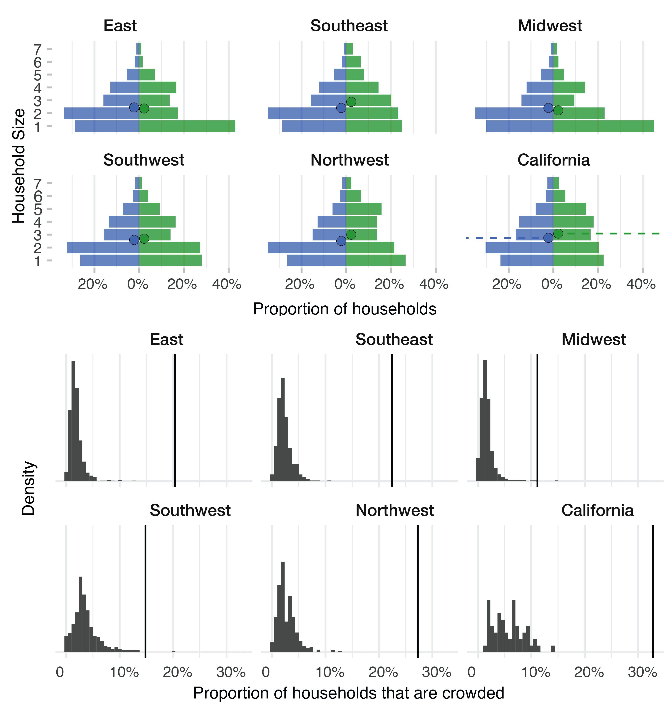

## Acknowledgments

## Funding

## Author contributions

## Competing interests

## Data availability

## References

## Supplementary Information

### Supplementary Methods

#### Data

Agricultural workers were defined as individuals employed in "farming, fishing, and forestry occupations" (ACS occupation codes C24030_004 [males] and C24030_031 [females]) as a proportion of total employed individuals (C24030_001).

County-level household size distributions were obtained from ACS table B11016 (Household Type by Household Size), which reports counts of family and non-family households by size. We combined family and non-family counts for each household size (1 through 7+). County-level household crowding was obtained from ACS table B25014 (Tenure by Occupants per Room), where crowded households were defined as those with more than 1.00 occupants per room, summing across owner- and renter-occupied units and all crowding levels (1.01–1.50, 1.51–2.00, and >2.00 persons per room). Total population was obtained from ACS table B01003.

To enable region-level analysis, we aggregated the county-level ACS data into the corresponding NAWS regions using population-weighted averages. For each variable (household size proportions, crowding proportions, and proportion of agricultural workers), we multiplied each county's value by its population, summed within each region, then divided by the total regional population. This ensures that larger counties contribute proportionally more to the regional estimate.

Household sizes in the NAWS data were derived from the HHFAMGRD variable (number of relatives on the household grid). Households of size 7 or greater were grouped into a single "7+" category for consistency with the ACS data. Crowding status was derived from the CROWDED1 variable. Both household size and crowding data were weighted using the NAWS survey weights (PWTYCRD) and summarized by NAWS region.

To assign crowding probabilities by household size, we used a linear relationship where larger households are progressively more likely to be crowded. For a household of size $n$, the crowding multiplier is:

$$w(n) = \begin{cases} 0 & n = 1 \\\ 1 + (d - 1) \cdot \frac{n - 2}{5} & n \geq 2 \end{cases}$$

where $d$ is the crowding fold difference parameter (the ratio of crowding probability for size-7 households to size-2 households). We treated households of size 7+ as $n = 7$. The crowding probability for each household size within a given geographic area is then:

$$p_{\text{crowded}}(n) = c \cdot w(n)$$

where the constant $\eta$ is chosen so that the weighted average across all household sizes equals the observed aggregate crowding proportion:

$$\eta = \frac{P_{\text{crowded}}}{\sum_n p(n) \cdot w(n)}$$

Here $P_{\text{crowded}}$ is the overall proportion of crowded households and $p(n)$ is the proportion of households of size $n$. With the baseline $d = 2$, households of size 7+ are twice as likely to be crowded as households of size 2, with a linear gradient in between; and the constant $\eta$ ensures that the total fraction of crowded households in the region (
$\sum_n p_{\text{crowded}}(n)$
) matches the proportion of crowded households from the ACS/NAWS data ($P_{\text{crowded}}$). 

The NAWS dataset reports household characteristics for agricultural workers at the regional level only, while the ACS provides county-level data for the general population. While our main analysis was at the regional level, we also performed a county-level analysis to assess geographic variation in outbreak disparities between agriculural workers and the general community. To generate county-level population estimates for agricultural workers, we used county-level ACS variation to adjust the regional NAWS values. The underlying assumption is that county-level variation among agricultural workers follows a similar pattern to county-level variation in the general population; i.e., if a county's general population has larger households than the regional average, agricultural workers in that county likely also have larger households than the regional average for agricultural workers.

For each county $i$ in region $r$, we first computed the population-weighted regional mean of the county-level ACS values:

$$\bar{p}_{\text{ACS},r}(n) = \frac{\sum_{i \in r} p_{\text{ACS},i}(n) \cdot N_i}{\sum_{i \in r} N_i}$$

$$\bar{q}_{\text{ACS},r} = \frac{\sum_{i \in r} q_{\text{ACS},i} \cdot N_i}{\sum_{i \in r} N_i}$$

where $p_{\text{ACS},i}(n)$ is the proportion of households with size $n$ in county $i$ according to ACS data, $q_{\text{ACS},i}$ is the proportion of crowded households in county $i$, and $N_i$ is the population of county $i$.

We then imputed county-level NAWS values using one of three methods (**Figure XX**):

*Additive method.* We shifted regional NAWS values by the difference between county-level and regional mean ACS values:

$$\tilde{p}_{\text{NAWS},i}(n) \propto \max\left(0, \; p_{\text{NAWS},r}(n) + \left[ p_{\text{ACS},i}(n) - \bar{p}_{\text{ACS},r}(n) \right] \right)$$

$$\tilde{q}_{\text{NAWS},i} = q_{\text{NAWS},r} + \left[ q_{\text{ACS},i} - \bar{q}_{\text{ACS},r} \right]$$

Household size proportions were clamped to be non-negative before renormalization, and the crowding proportion was clamped to $[0, 1]$.

*Multiplicative method.* We scaled regional NAWS values by the ratio of county-level to regional mean ACS values:

$$\tilde{p}_{\text{NAWS},i}(n) \propto p_{\text{NAWS},r}(n) \times \frac{p_{\text{ACS},i}(n)}{\bar{p}_{\text{ACS},r}(n)}$$

$$\tilde{q}_{\text{NAWS},i} = q_{\text{NAWS},r} \times \frac{q_{\text{ACS},i}}{\bar{q}_{\text{ACS},r}}$$

The household size distribution was renormalized to sum to 1, and the crowding proportion was clamped to the interval $[0, 1]$.

*Null method.* We used regional NAWS values directly without adjustment:

$$\tilde{p}_{\text{NAWS},i}(n) = p_{\text{NAWS},r}(n)$$

$$\tilde{q}_{\text{NAWS},i} = q_{\text{NAWS},r}$$

This method assumes no county-level variation in agricultural worker household characteristics within a region.

**Crop movement data.** **TO FILL IN: Cross-referencing of crop movement data with UCDavis information, with figure.** 

#### Mathematical model structure

The household-structured SIR model (**Figure XX**) tracks the distribution of households across disease states. Let $H_k(x,y,z,c)$ denote the number of households in population $k$ (where $k \in \{C, A\}$ for community and agricultural populations) with $x$ susceptible, $y$ infected, and $z$ recovered members, and crowding status $c \in \{0,1\}$. The total household size is $n = x + y + z$.

The dynamics are governed by three types of transitions:

- **Recovery transitions:** Infected individuals recover at rate $\gamma$, moving a household from state $(x,y,z,c)$ to state $(x,y-1,z+1,c)$:
$\text{Recovery rate} = \gamma \cdot y \cdot H_k(x,y,z,c)$

- **Within-household transmission:** Susceptible individuals are infected by household members at rate $\tau_c = \tau_{\text{base}} + \tau_{\text{boost}} \cdot c$, moving a household from state $(x,y,z,c)$ to state $(x-1,y+1,z,c)$:
$\text{Within-household infection rate} = \tau_c \cdot x \cdot y \cdot H_k(x,y,z,c)$

- **Between-household transmission:** Susceptible individuals are infected through community contacts at rate $\lambda_k$, determined by the mixing matrix and overall prevalence in each population:
$\text{Between-household infection rate} = \lambda_k \cdot x \cdot H_k(x,y,z,c)$

The force of infection for population $k$ is:
$\lambda_k = \beta \left[ m_{kk} I_k + m_{kj} I_j \right]$

where $I_k$ is the prevalence in population $k$:
$I_k = \frac{\sum_{x,y,z,c} y \cdot H_k(x,y,z,c)}{\sum_{x,y,z,c} n \cdot H_k(x,y,z,c)}$

The mixing matrix elements are:
$m_{kk} = (1-\epsilon) + \epsilon w_k$
$m_{kj} = \epsilon w_j$

where $w_k = \frac{N_k}{N_C + N_A}$ is the population fraction in group $k$.

The complete system of ordinary differential equations is:
$\frac{dH_k(x,y,z,c)}{dt} = \text{inflow} - \text{outflow}$

where inflow includes households transitioning into this state via infection (from state 
$(x+1,y-1,z,c)$
) or recovery (from state 
$(x,y+1,z-1,c)$
), and outflow includes households leaving this state through infection or recovery. 

#### Mathematical model parameterization

We derived the within-household transmission rate, $\tau$, using the recovery rate $\gamma$ and the secondary attack rate (SAR). The SAR is determined by the competing rates of within-household infection ($\tau$) and recovery ($\gamma$). The probability that the susceptible individual is infected before the infectious index case recovers is:

$$\text{SAR} = \frac{\tau}{\tau + \gamma}$$

Solving for $\tau$:

$$\tau = \frac{\text{SAR} \cdot \gamma}{1 - \text{SAR}}$$

For the baseline uncrowded SAR of 20% and $\gamma = 1/5$: 

$$\tau = \frac{(0.2)(0.2)}{1 - 0.2} = 0.05$$

For crowded households, we computed $\tau_{\text{crowded}}$ using the same formula with the crowded SAR, then defined $\tau_{\text{boost}} = \tau_{\text{crowded}} - \tau$. For the baseline crowded SAR of 40%: $\tau_{\text{crowded}} = 0.40 \times 0.2 / 0.60 \approx 0.133$ and thus $\tau_{\text{boost}} \approx 0.083$. 

Next, we calibrated the between-household transmission rate $\beta$ to achieve target $R_0$ values by running the model at the national level with aggregated ACS household data and systematically varying $\beta$ until the final attack rate matched theoretical predictions for the desired $R_0$. For an SIR model, the relationship between $R_0$ and final attack rate $R_\infty$ is given implicitly by:
$R_\infty = 1 - e^{-R_0 R_\infty}$

For example, $R_0 = 1.2$ corresponds to $R_\infty \approx 0.31$, and $R_0 = 2.0$ corresponds to $R_\infty \approx 0.80$. We used a bisection search algorithm to find $\beta$, converging when the simulated final attack rate was within 0.0005 of the theoretical value. Calibration was performed using a single-population simulation at the national level, with national household distributions computed as population-weighted averages of all county-level ACS data. The calibrated $\beta$ values were then used in the full two-population regional simulations. We assumed no difference in $\beta$ between agricultural workers and the general community, so that all of the transmission differences in the model would come from differences in household size and crowding. 

We initialized outbreaks by setting 0.1% of individuals in each sub-population as infectious. The initial infectious individuals were distributed proportionally across household types, weighted by household size: for each household type with $n$ members, a fraction $\text{initprev} \times n$ of those households were moved from the fully susceptible state $(x = n, y = 0, z = 0)$ to the state $(x = n-1, y = 1, z = 0)$. This is equivalent to uniformly randomly selecting 0.1% of individuals to be initially infected, then distributing them across household types according to the population distribution.

#### Symptomatic infection and workforce impact

To translate epidemic dynamics into agricultural workforce availability, we computed the proportion of the agricultural workforce experiencing symptoms on each day. We first calculated the number of new daily infections for each day as $i_t = S(t-1) - S(t)$, where $S(t)$ is the proportion susceptible at time $t$. We assumed symptoms began one day after infection onset and lasted for three days, so that individuals infected on day $t$ were symptomatic on days $t+1$, $t+2$, and $t+3$. The proportion of symptomatic individuals on day $t$ was then:

$$\text{symp}_t = p_{\text{symp}} \sum_{d=1}^{3} i_{t-d}$$

where $p_{\text{symp}}$ is the probability that an infection is symptomatic. Daily workforce strength was defined as $\text{wf}(t) = 1 - \text{symp}(t)$. 

To assess the impact of epidemic timing on crop production, we shifted the epidemic curve so that the community symptomatic peak aligned with each day of the calendar year. The outbreak-adjusted harvest volume for each crop on each day was $V_{\text{adj}}(t) = V(t) \times \text{wf}(t)$, and total annual production loss was $(1 - \sum_t V_{\text{adj}}(t) / \sum_t V(t)) \times 100\%$.

### Supplementary Figures

**Figure SXX.** Model structure.

**Figure SXX.** Household size and crowding distributions by population and region

**Figure SXX.** Sensitivity of attack rates to reproduction number (R₀). Attack rates for agricultural workers (red) and general population (blue) across regions for R₀ = 1.2, 1.5, 2.0, and 3.0.

**Figure SXX.** Sensitivity to assortative mixing parameter (ε). Attack rate differentials (agricultural workers minus general population) for ε = 0, 0.33, 0.5, and 0.7.

**Figure SXX.** Sensitivity to secondary attack rate in crowded households. Attack rates by population for crowded household SAR = 30%, 40%, 50%, and 60%.

**Figure SXX.** Sensitivity to crowding fold difference. Impact of varying the relationship between household size and crowding probability (fold difference = 1, 2, 3).

**Figure SXX.** Sensitivity to county-level NAWS adjustment approach. Comparison of attack rate differentials under three approaches: (A) Null method (regional NAWS values used directly), (B) Additive method (baseline; county-level deviations from regional ACS means added to regional NAWS values), (C) Multiplicative method (regional NAWS values scaled by ratio of county-level to regional mean ACS values).

**Figure SXX.** Regional heterogeneity in baseline results. Attack rate differentials by region, with inset showing relationship to regional agricultural worker proportion and crowding levels.

**Figure SXX.** Productivity impacts by outbreak timing. Seasonal productivity losses for strawberries, lettuce, and oranges as a function of outbreak peak timing (day of year).

### Supplementary Tables

**Table SXX.** Regional household size and crowding data from ACS and NAWS

**Table SXX.** Crop calendar and labor intensity data by region  

**Table SXX.** Baseline and sensitivity analysis parameter values. Complete specification of all parameter combinations examined.

**Table SXX.** Simulation results summary across all scenarios. Peak prevalence, time to peak, and final attack rate for agricultural workers and general population under all parameter combinations.